# From 1 > billion years to < 1 second

"An algorithm must be seen to be believed" - *Donald Knuth, 1968*

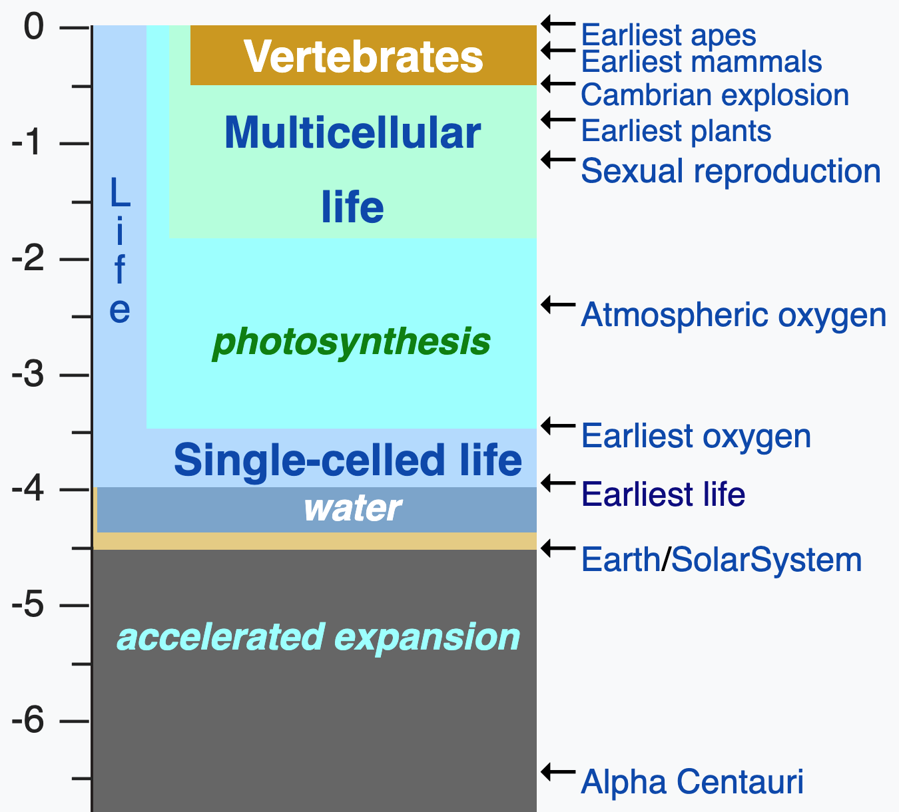

???

## Context 5 billion years
Good morning! I choose this image of the timeline of Earth to put things in context. 5 billion years is a long time... Way too long to wait for a computation to finish.

## With this 2012 laptop and Python it will become <1 second
Today I am going to present an algorithm in Python3 that takes longer than the existence of the Solar System in this 2012 laptop. I am going to show a dozen optimisation techniques to create an equivalent Python3 program that takes less than 1 second.

## Code is usable for real and public in github.
But rather than just describing them in abstract, I am going to apply them incrementally, so one can see they are effective, can be used together and are adaptable to real problems. All the code and results is in a public github repository for anybody to verify.

Let's move on!

---

## Problem definition.

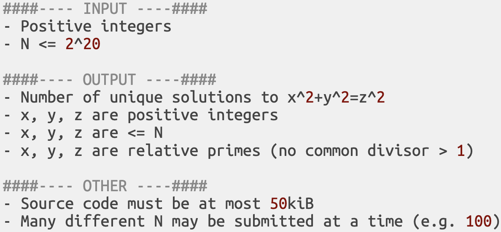

???
## Simple: read an integer and write an integer.
The input consists of positive integers up to 1.05M

## Output: read the list.
Emphasis on UNIQUE equation solutions.

## No precalculation
There is a strict limit on the source size. Precalculating 1M results and simply printing them is not a valid "fast solution".

## Size of input
To simplify we will only consider N=2^20 at the beginning, but later we will assume the input to be 100k random numbers < 2^20.

---

## Solutions (first 48 samples).

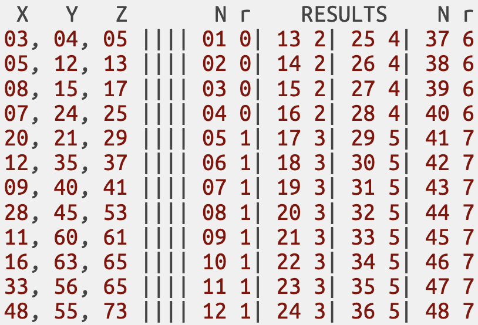

???
A sample of the first 50 solutions will probably help make the previous description easier to understand.

## Columns X, Y, and Z
They represent the unique triplets which fulfill all the restrictions we describer previously. Sorted by number, from small to large.

## Result columns. N -> input; r -> result
When N is < 5 the result is 0. We can see no triplet exists with a Z smaller than 5. The next triplet has Z = 13. That means the result from 5 to 12 will be 1. And so on.

Here one can see a pattern 4...8...4...8... but it gets more complicated after 48

---

## Time measurements.
#### Timing
- Code is run using python3.7 using this **2012 laptop**.
- Best of **5 runs** for each algorithm and input.
- Increase problem size until set takes **>600 seconds**.
- **Discard** problem sizes with time **< 0.15 seconds**.
- Calculate **ETA using** time complexity estimation of **biggest 3 inputs**.
- e.g. `if size*2 -> time*8 then complexity=O(n^3)` because (2^3 -> 8).

#### Sources
- `github.com/isaacbernat/presentations/tree/master/optimise`
- Specific timings at `times.csv`.
- Summary, ratios and more at `timings.md`.

???
## Specs and details on github
- More complete details on the laptop specs and how I measured the time are available in a public github repository, along with the code.

## Complexity esimation
- But before I go on, one may wonder how I estimated times greater than years. I calculated the biggest N possible under 10 minutes and then I interpolated the result with the 3 previous biggest Ns. For example:
    - N=100, t=1min;
    - N=200, t=8min;
    - N=400, t=64min;

We could infer that N X 2 -> t X 8;. That would be a cubic complexity. It would be linear if N X 2 -> t X 2, but this case the relation is bigger than that. For each different version we calculate the progression and scale it up to N=2^20 and then 100k Ns

PD: Yes, I know, one easy speedup would be getting a new laptop ;D

## More details below
- The laptop **specs** can be found in the **github url**. Just a **new laptop** would probably be a **good speedup** ;D.
- Best of 5 runs (extra time is overhead from OS, etc).
- 600s should be big enough to provide robust numbers and minimise the noise.
- Small times have higher variablity non-dependent on algorithm.
- We don't have billions of years to wait and get result, but we want to compare different algorithms that are much faster and can't use the same input.
- Feel free to replicate the experiments. If on a different machine they may vary accordingly, but I think should be within the same order of magnitude?
optimise time, vs memory, a specific shared resource, etc.

---

## How good are you at estimating speedups?.
## https://tinyurl.com/pycon2019
### Results from the above form will be published in a few days.
### How fast code is compared to the previous version?
#### current_time / previous_time.
#### E.g. if the code now takes half the time it is 2x (1/0.5). If it takes 75% the original time it is 1.33x (1/0.75).
### Compare Python to Python but also PyPy to PyPy for extra fun!

???
Before we start reading code, to make it a better learning experience, I'd suggest you to either go to that URL and fill the form as we go or to take a piece of paper and write down notes. I'd like you to estimate the magnitude of the speedup for each optimisation introduced relative to the previous code. You can assume we are using the latest Python and/or PyPy.

The way to write it is the following (E.g. if the code now takes half the time it is 2x (1/0.5). If it takes 75% the original time it is 1.33x (1/0.75).)

## Alt: piece of paper
If you don't want to use the url above, even a piece of paper can be fun. But then it will be harder for other people to compare to you :P

---

## v0 Baseline.
### `ETA N=2^20:` 98.263 years `; ETA 100k N<=2^20:` >1 Bn

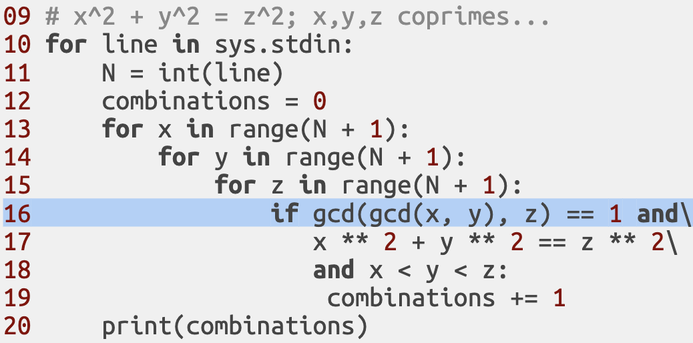

???

Let's begin! The execution for this code is around 100k years for N=2^20. Definitely more than 1 Billion years for 100k random Ns.

A naive solution would be something like the one we see. We go through all X, Y and Z up to N and for each check that they are coprime, their square sums follow the equation and that X < Y < Z.

That last part is to avoid repetitions, since swapping X for Y the equation would still be valid but we don't want to count that. We could have also put the triplets in a set and simply do `len()`on it. Consider this already an optimisation if you may. We are only interested in the amount no which exact triplets.

But before we evaluate how good/bad the code is... we need to see it all, right? How is gcd (Greatest Common Divisor) calculated?

---

## v0 Baseline.

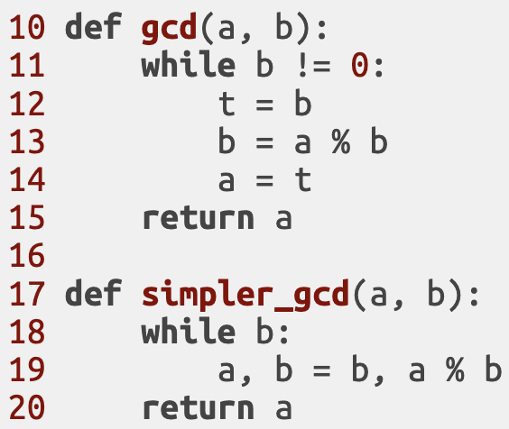

???
## Euclidean Algorithm
The classic algorithm does the job. In this example we use the first version with a temporary variable, which is not as efficient the second, but good enough for our case.

---

## v1 Don't reinvent the wheel.

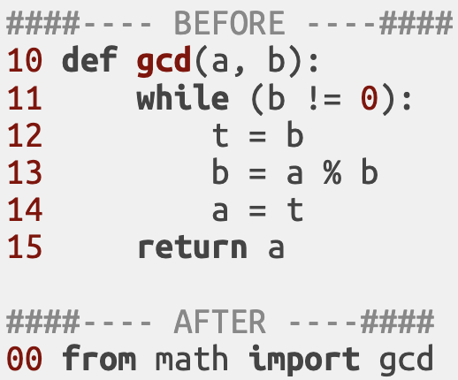

???

# v1
If the functionality needed can be found in a trusted library, it's a good idea to try that before considering reimplementing it (and not just for performance reasons).

### ASK ABOUT TIME ESTIMATING SPEEDUP

---

## v2 Peephole optimization/strength reduction.
### V1 vs V0 speedup: 1.61x

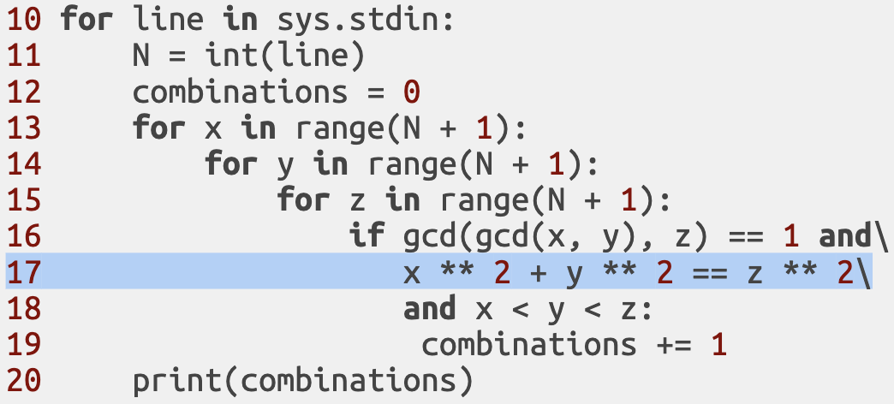

???
This technique is about replacing overly generic functions by more specific ones. For example in binary integer arithmetic, we know that multiplication by a power of 2 can be expressed as a simple "shift" operation. E.g. multiplication by 16 (2^4) means moving 4 bits to the left. For most architectures this is computed faster.

### ETA V1 N=2^20: 60.943 years

---

## v2 Peephole optimization/strength reduction.

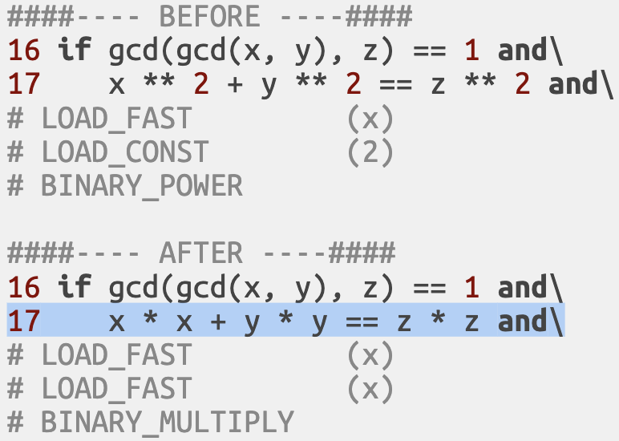

???

The affect code is highlighted:
- Exponentiation is generic and expensive.
- Squaring is specific and cheap.
- We can see the difference clearly in CPython bytecode (more on that later), the most significant change being POWER vs MULTIPLY

---

## v3 Short-circuit evaluation.
### V2 vs V1 speedup: 2.19x

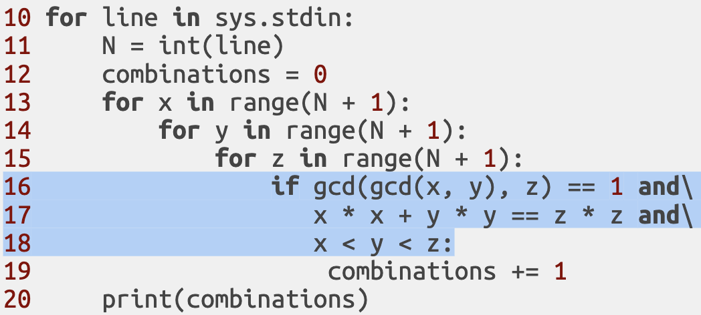

???
### ETA V2 N=2^20: 27.714 years

As we can see, the exponentiation is replaced by multiplication now.

From a logic point of view, the order does not matter. But most computers execute code sequentially. That is, one condition must be evaluated first, then a second one and so on. If the first results false, the next one doesn't need to be evaluated as the whole condition will be False. If the first is True then the second one needs to be evaluated. The reverse process would be applicable for chained OR conditions.

Further references: https://docs.python.org/3/library/stdtypes.html#boolean-operations-and-or-not

---

## v3 Short-circuit evaluation.

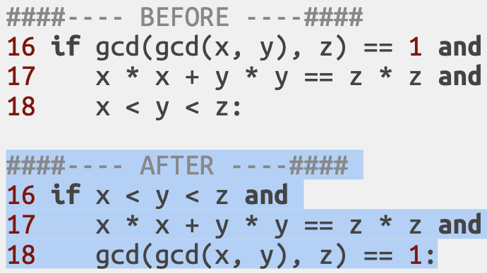

???
Short-circuiting consists on arranging parameters so the ones more likely to fail (and/or cheaper to compute) are evaluated first (last in case of OR chains). Keep in mind that it may affect branch prediction on modern CPUs.

In our example we move the expensive gcd to the end and the cheap integer comparison first.

---

## v4 Search space reduction.
### V3 vs V2 speedup: 2.58x

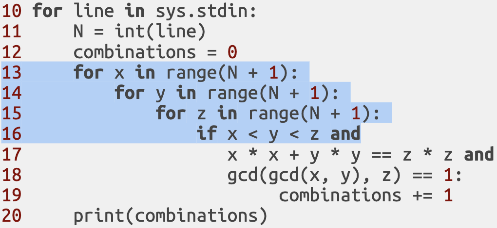

???
### ETA V3 N=2^20: 10.717 years

A way to speed up code is to avoid checking conditions that we know beforehand are not going to be satisfied. Here we are going to avoid going through ranges partially by enforcing restrictions earlier.

---

## v4 Search space reduction.

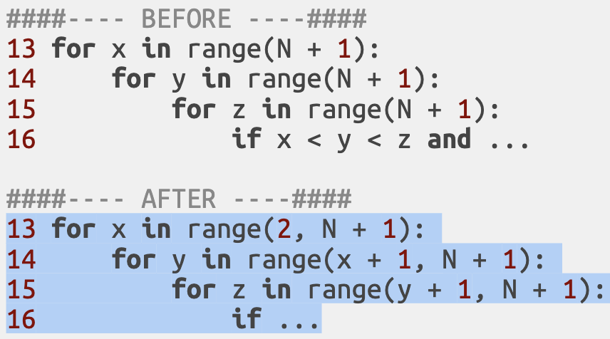

???

In our case we want Y > X and Z > Y. We can start the ranges with those initial values instead of 0. This way we avoid many comparisons that we know will be false.

---

## v5 Code hoisting.
### V4 vs V3 speedup: 3.56x

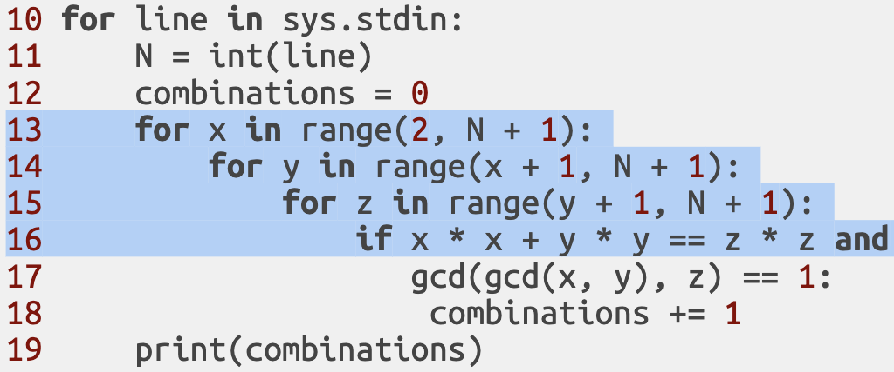

???
### ETA V4 N=2^20: 3012 years

Similar to previous optimisation, this one consists on moving calculations that we know will not change within a loop outside. These kind of expressions are known as invariants.

---

## v5 Code hoisting.

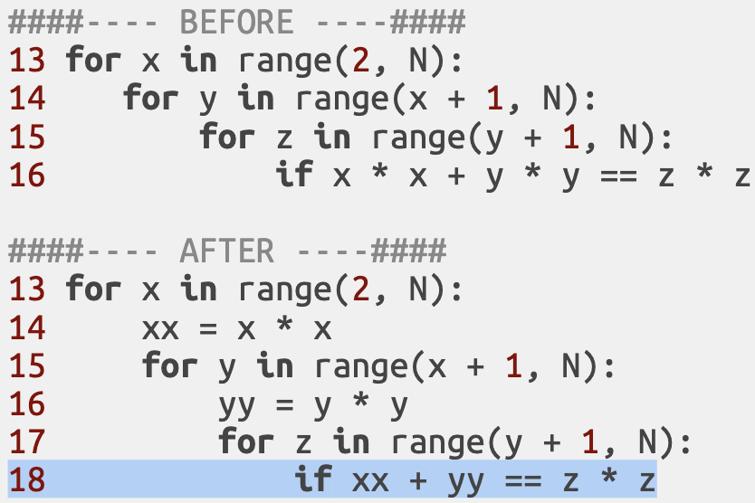

???

As long as Y does not change, Y x Y won't change too. Same reasoning may be applied for X.

---

## v6 Function calls vs inline code.
### V5 vs V4 speedup: 1.83x

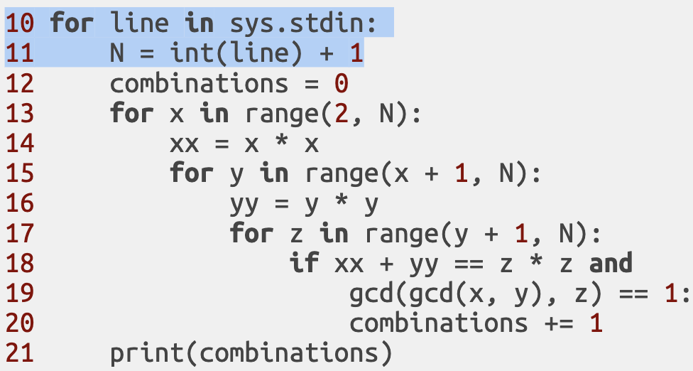

???
### ETA V5 N=2^20: 1647 years

Programs are divided into scopes. Every time a function is called there is a context change. Part of the current state needs to be saved and not affected by "code executed in function". Usually all this is kept in a stack in memory that needs to be restored when the function returns. But talking about the details here is out of the scope (pun intended ;D). The point is that each function call incurs overheads.

---

## v6 Function calls vs inline code.

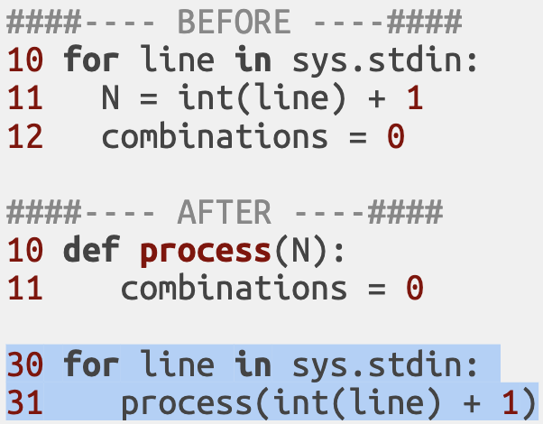

In our case the change is to make the calculation of N be a function instead of part of the "main" script code. A side-effect is that it makes the code more structured and readable too.

---

## v6 Function calls vs inline code.

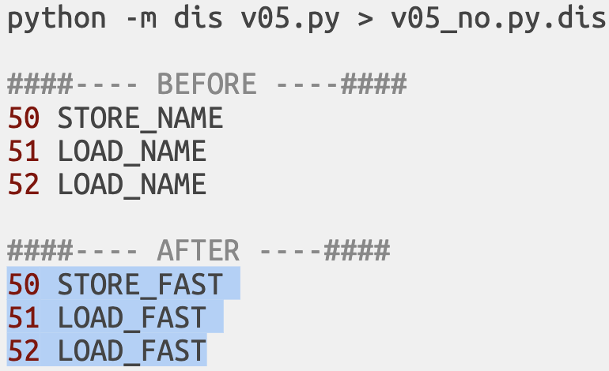

???

No guarantees are made that the transformation from Python code to the intermediate bytcode used by CPython will be compatible/or the same between versions (implementation may change), so keep that present. Here we see that STORE_NAME and LOAD_NAME are replaced by STORE_FAST and LOAD_FAST using the `dis` disassembler package. This change has implications on execution time that may or may not compensate the extra function call overhead. What do you think? Always measure instead of relying in intuitions only.

Apparently this `dis` behaviour has been true at least since 2014 in python 2.7 and is still true today (current version of python 3.7.4).

References:
- https://stackoverflow.com/questions/21107131/why-mesh-python-code-slower-than-decomposed-one
- https://docs.python.org/3/library/dis.html (the official disassembler package)

---

## v7 Code specialisation
### V6 vs V5 speedup: 2.03x

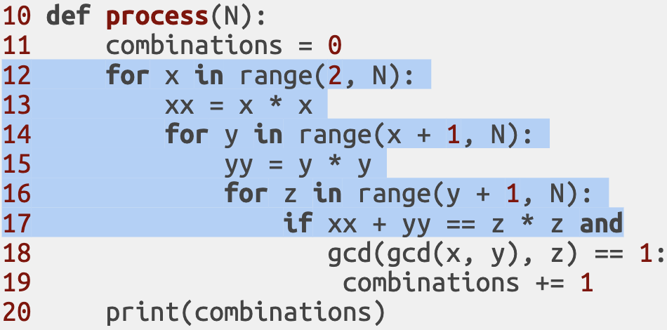

???
### ETA V6 N=2^20: 811 years

Problem-specific. We save 6/8 computations. Numbers must be coprimes. At most one number in the triplet can be even (divisible by 2). This let's us increment loops by 2 to keep variables either even or odd as required.

---

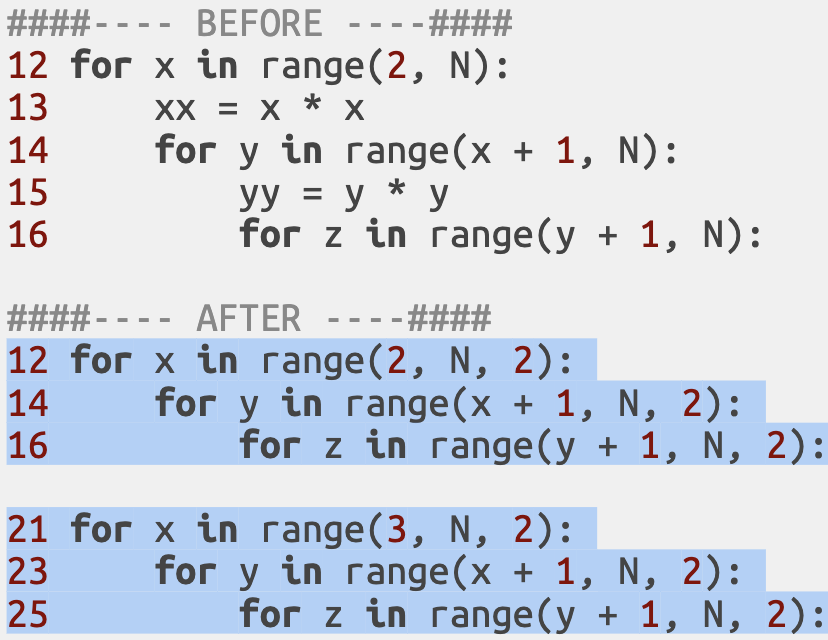

???

---

## Interlude: Compilers
### V7 vs V6 speedup: 4.15x

### PyPy
- JIT (just in time). Can take into account usage data be more efficient.
- Replace `"python3"` with `"pypy3"`
- Many other "python-based" options are avialable: e.g. Numba, Cython...

### C++ 17
- Can be close to the machine.
- Tried to be faithful when porting Python to keep comparisons fair.
- `g++` (from GNU Compiler Collection) the standard open source compiler.
- Flags used `"-O0"` and `"-O3"`.

???
### Definition
Compilers translate a source language (python) into another (bytecode). They also can apply optimisations, analysing the whole source code and how it behaves.

PyPy is just one of many tools to speedup python.
### Numba didn't like gcd
### Cython converts "python" code to C. Needs to define data types to be really effective.
### there are others, but the presentation is already quite long as it is.

## C++
- Tried to be as faithful as possible when porting code from the original python source. Some idioms are not available and forced a different implementation, of course.
- I ported it to C++ 17, so I could use the built-in gcd library and compare it with the v1 optimisation (i.e. don't reinvent the wheel!).
- g++ (from GNU Compiler Collection) is a production-grade compiler used and relied upon by many. We'll use it in our tests.
- I used -O0 and -O3 optimisation levels. But many more useful optimisation flags exist (e.g. march) that may increase speedup even more.

---
<!-- <object type="text/html" width="100%" height="100%", data="plots/timing7.html"/> -->
<embed style="margin-left:-2rem" src="plots/plot_eta7.html" width="110%" height="100%"></embed>

???

---
<embed style="margin-left:-2rem" src="plots/plot_speedup7.html" width="110%" height="100%"></embed>

???

---
<embed style="margin-left:-2rem" src="plots/plot_size_complexity7.html" width="110%" height="100%"></embed>

???

---

## v8 Paradigm shift.

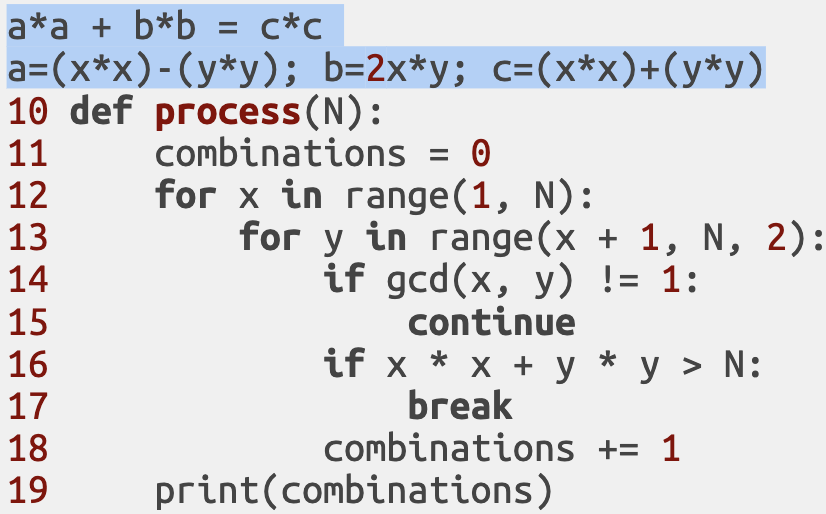

???
### ETA V7 N=2^20: 195 years. v0 was 98.263. That's >500x total!

Significant speedups can be achieved using non-incremental approaches. In this case we use a calculation based on Euclid's formula to generate primitive pythagorean triples.

Didn't know if I should call it "paradigm shift", "do research", or "full rewrite".

People get attached to code, and there is this sunk cost fallacy which prevents people from discarding and recognising the "wasted effort" when that would be the more effective approach.

---

## v9 Early loop termination.
### V8 vs V7 speedup: 9 172 593 998x; N=2^20: 1.1s (v7 ETA 195years)

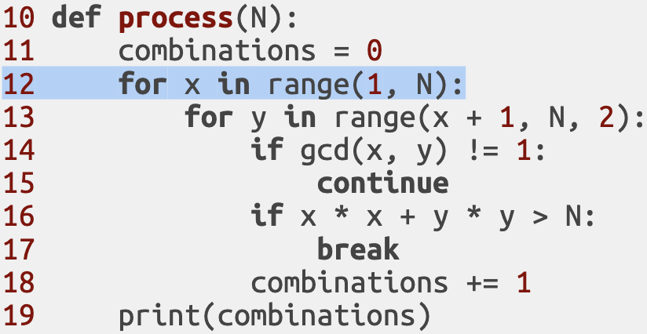

???
### V8 ETA 100k N>=2^20: 67.165s
### `sqrt(N) * sqrt(N) = N`
### Adding anything to N will make it > N. Therefore invalid as we see in line 17. Let's save those computations. Don't need to go all the way through N.

---

## v9 Early loop termination.

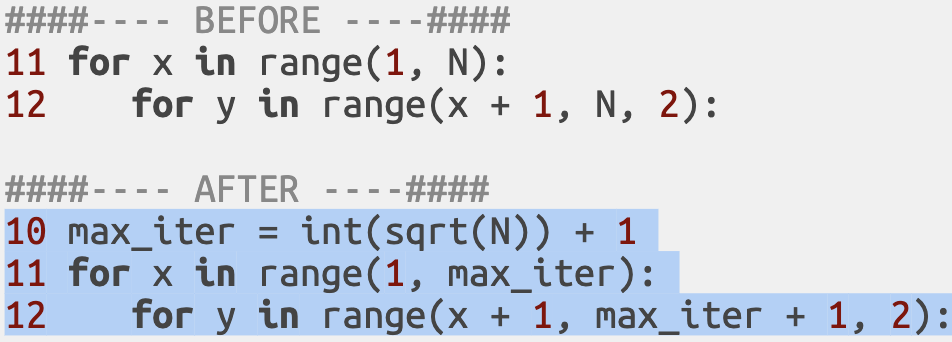

---

## v10 Expensive vs cheap ops.
### V9 vs V8 speedup: 14.82x

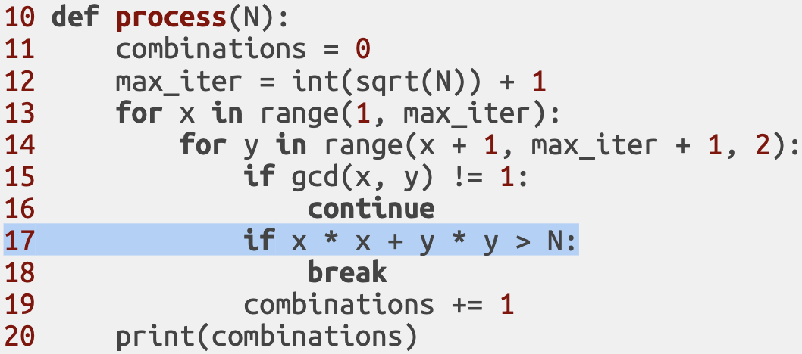

???
### V9 ETA 100k N>=2^20: 4531s

A few SQRTs can save many squares here.

---

## v10 Expensive vs cheap ops.

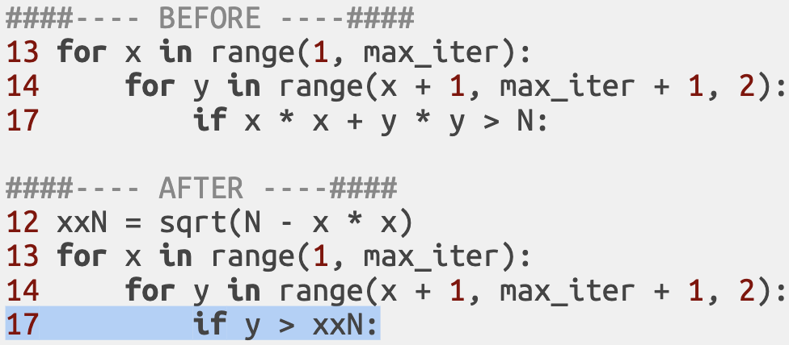

---

## v11 Mind types.
### V10 vs V9 speedup: 1.28x

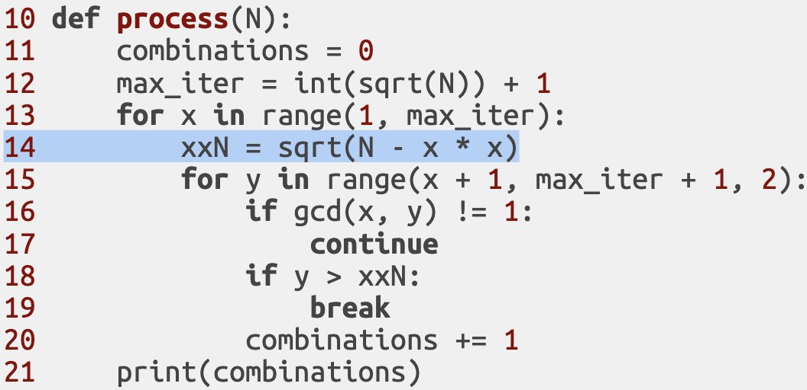

???
### V10 ETA 100k N>=2^20: 3531s

Avoid int to float castings in the loop. Even if it quacks like a duck, there are different kinds of ducks (i.e. implicit conversions).

---

## v11 Mind types.

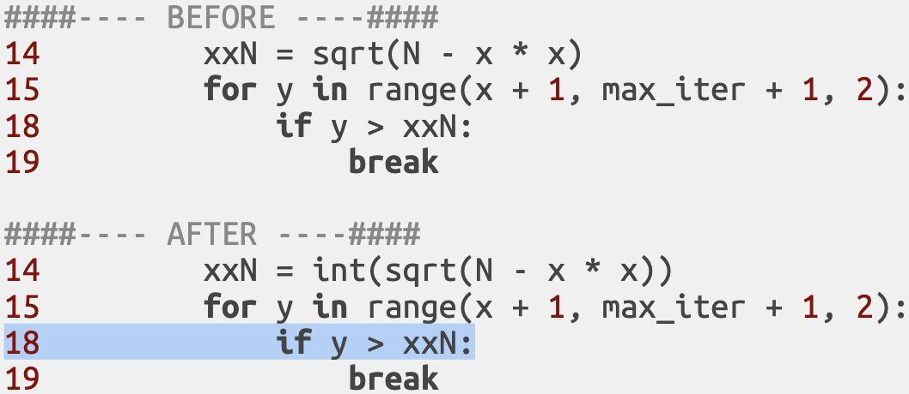

---

## Interlude: Profiling
### V11 vs V10 speedup: 1.01x

#### Amdahl's law*
- The non-optimised part sets an upper bound on speedup.
- Fragments which take 1/3 of time will NEVER be faster than 1.5x.
- Useful to choose where to focus on and the potential upside.

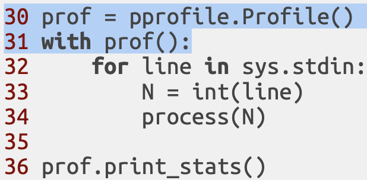

???
## DO ask to write previous speedup!

Previous speedup was... modest (<1%). Time measurement doesn't need to be a black box. Let's profile the code to see what to optimise next

### Amdahl's law
- Added the * because he referred to parallellisable code. Not exactly the same context here, I know.
- Mention Amdahl's law vs Gustafson's law? That only applied to parallel computing though...

References: Amdahl's law http://demonstrations.wolfram.com/AmdahlsLaw/

### pprofile
- it allows line-by-line (cProfile, python's standard granularity is functions)
- is deterministic (good for tasks that take few seconds)
- easy to install with pip and easy to use
- the image shown in next screen is a simplified output

---

## Interlude: Profiling

### `github.com/vpelletier/pprofile`

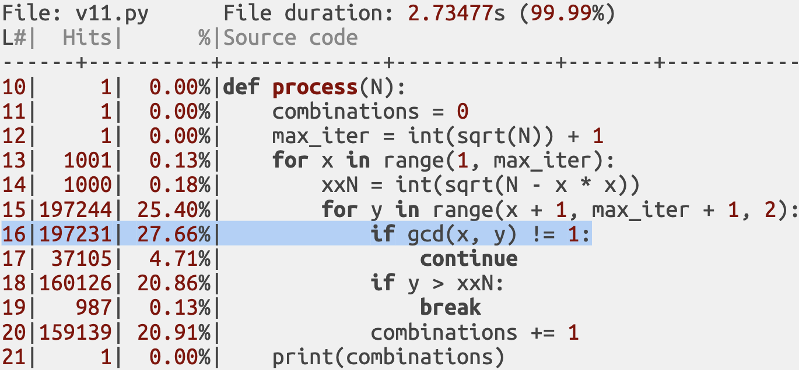

???

### statistical vs deterministic profilers?
- det: overhead (can't be used in prod)
### about 50x slower
### 2.73s vs ~0.06s; N=1024*1024
### 154s  vs  3.26s; 100 of 0 < N <= 1024*1024
- implemented in python. There may be less portable C versions with smaller overhead

- stat: needs long run time to be reliable
this profiles also supports statistical mode

---

## v12 Memoisation (without r, no typo here).

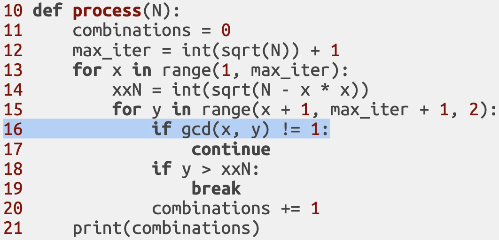

???
### V11 ETA 100k N>=2^20: 3513s

Avoid int to float castings in the loop. Even if it quacks like a duck, there are different kinds of ducks (i.e. implicit conversions).

---

## v12 Memoisation.

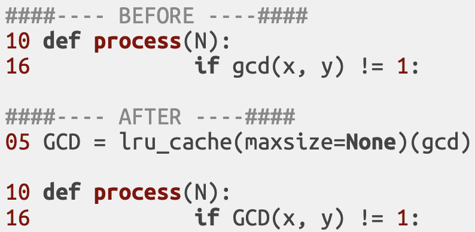

---

## v13 Reuse results.
### V12 vs V11 speedup: 0.81x

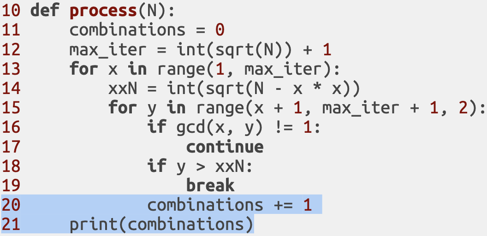

???
### V12 ETA 100k N>=2^20: 4297s

... but wait, in this case the lru_cache was actually more expensive than calculating it each time! We won't be adding that "optimisation" (also always remember to measure!)

---

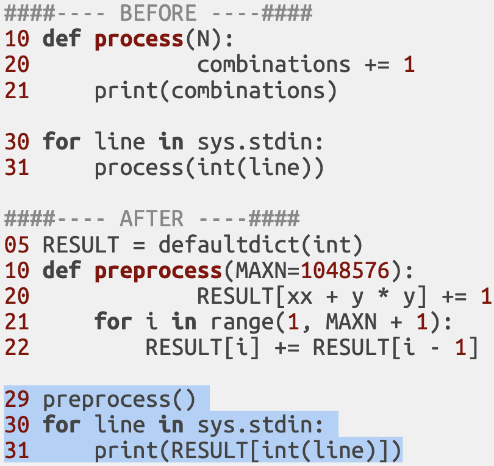

---

## v14 Reduce memory footprint.
### V13 vs V12 speedup: 3978.92x

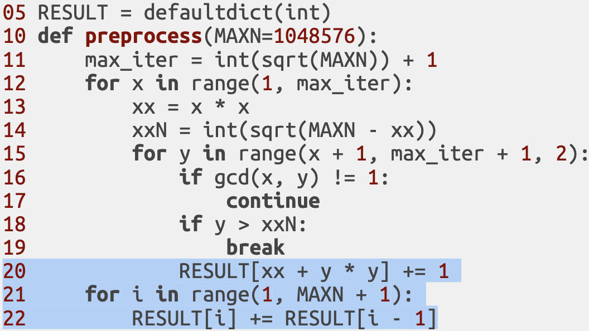

???
### V13 ETA 100k N>=2^20: 1.08s

... but wait, in this case the lru_cache was actually more expensive than calculating it each time! We won't be adding that "optimisation" (also always remember to measure!)

---

## v14 Reduce memory footprint.

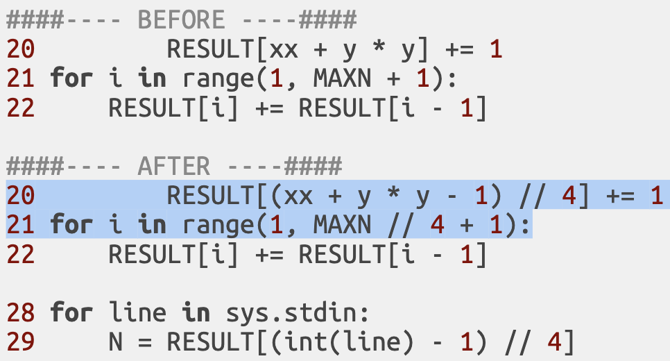

???

---

## The end? (V14 vs V13 speedup: 1.77x)

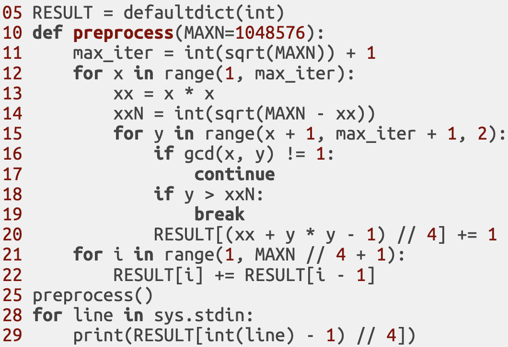

???
### V14.py ETA 100k N>=2^20: 0.61s
### V13.py ETA 100k N>=2^20: 1.08s
### V13.c  ETA 100k N>=2^20: 0.05s

... but wait, in this case the lru_cache was actually more expensive than calculating it each time! We won't be adding that "optimisation" (also always remember to measure!)

---
<embed style="margin-left:-2rem" src="plots/plot_eta14.html" width="110%" height="100%"></embed>

???

---
<embed style="margin-left:-2rem" src="plots/plot_speedup14.html" width="110%" height="100%"></embed>

???

---
<embed style="margin-left:-2rem" src="plots/plot_size_complexity14.html" width="110%" height="100%"></embed>

???

---
<embed style="margin-left:-2rem" src="plots/plot_speedup_vs14.html" width="110%" height="100%"></embed>

???

---

## v1337 The end is just another beginning

- `v14.py` vs `1337.cpp`
    - 0.6 Kib vs  15 Kib
    - 30 lines vs 140 lines
    - Readability, maintainability, portability... not easily measured.

### Noteworthy C++ optimisations:
- vectorisation (via SIMD (Single-instruction multiple-data))
- memoisation of `GCD` (already 43x on v12)
- smaller memory footprint (e.g. `chars` for `gcd(m, n) == 1`)
    - bithacks and masks has even smaller footprint!
- `struct union` to reuse all memory allocated for `GCD == 1` for results, even when they have different data types.
    - 4 `char` -> 1 `int`, so it fits!
- read input entries while calculating the results in parallel (using threads).
- do so in bulk (128 entries at a time)
- reading/writing on a shared memory buffer simultaneously for a smaller memory footprint.

???
Many other interesting techniques
- threads (for calculations too, splitting a big task)
- branch predictions (especially important on pipeline processors)
- conditional move (both computed, but hit rate independent)
- loop unrolling (space-time tradeoff). Beware of data dependencies.
- function inlining
- rematerialisation (vs code hoisting)
- pre-compute vs do it on demand
- bit hacks
- loop fusion/fission
- and many more! (for fun check LEA for multiplications on x86)

### V1337.c  ETA 100k N>=2^20: 0.02s
### V9001.c  ETA 100k N>=2^20: 0.03s

### non-noteworthy (compiler should do):
- do while (vs for loop)
- preincrement (vs postincrement, e.g. ++i vs i++)

---

## Typical pitfalls
#### Not considering Amdahl's law*
#### Optimising code still in development.
#### Not measuring time/resources properly.
#### Not checking result correctness.
#### Including more than 1 optimisation at once.
#### Ignoring usage constraints (e.g. cache size, IO).
#### Not knowing when to stop.

???
#### Amdahl: If the code optimised takes only 1% of time, even if it's n^3 to n optimisation speedup will be <1%

#### Still dev: code may change. Optimisations may not even apply after the refactored version with the correct logic is delivered. That's wasted effort/development time.

#### Proper measurement. Timings should be taken several times to avoid outliers, also the machine load and state should be as close as possible as the state that is compared with. Usage should be as close to production/reality as possible. That includes other programs running.

#### One may forget to be thorough on results, just looking at time.

#### Hard to know the effects of each specific one. Maybe one actually makes the code slower, but when put together is not noticeable.

#### Knowing cache sizes to avoid misses (e.g. by accessing matrixes in bocks) can have a big impact on performance. On a higher level, handling slow resources (e.g. disk IO, HTTP requests) asyncronously (if possible). This can go undetected if only measuring CPU time too.

#### Good enough is good enough. Performance requirements are important. E.g. if we only want numbers < 50 the code for v00.py is perfectly fine. In fact is faster than v13.py .

---

## Methodology
### `WHILE` not is_acceptable(performance):
#### 0. Analyze performance of current code.
#### 1. Apply ONE optimization.
#### 2. Check correctness of results.
#### 3. Analyze performance of the new version.
#### 4. Decide if the optimization should be included.

---

## Specials thanks: `github.com/isaacbernat`
### Mattias Johansson, Ivbar, LOGEX Group; `github.com/folkol`
### David Garcia Villalba, Zhilabs, Samsung; `github.com/dagavi`

"Programmers waste enormous amounts of time thinking about, or worrying about, the speed of noncritical parts of their programs, and these attempts at efficiency actually have a strong negative impact when debugging and maintenance are considered. We should **forget about small efficiencies, say about 97% of the time**: premature optimization is the root of all evil. Yet we should **not pass** up our opportunities in **that critical 3%"** - *Knuth, 1974*

"It is often a mistake to make **a priori judgements** about what parts of a program are really critical..." - *Knuth, 1974*

"In established engineering disciplines **a 12 % improvement**, easily obtained, **is never considered marginal** and I believe the same viewpoint should prevail in software engineering" - *Knuth, 1974*

["Structured Programming with go to Statements"](https://web.archive.org/web/20131023061601/http://cs.sjsu.edu/~mak/CS185C/KnuthStructuredProgrammingGoTo.pdf) (page 8 of the pdf)

???
### For once I have not highlighted the most (in)famous part of the quote about "premature optimization is the root of all evil". I think he meant that one should focus on bottlenecks when doing **incremental optimisations**. Note that he talks about "small efficiencies". I think optimisations which change time complexity, say from N^3 to N^2 won't be in the same league and should be considered (considered != automatically applied, for small Ns the difference won't probably matter, there are also setup times, etc. and keep in mind Amdahl!).
### So... always measure! I hope writing down and checking speedups helped you see how much off one may be!
### All quotes above taken from here. GOTO statements are not a hot topic anymore, but there are yet more still valid quotes in that paper surrounding the topic of code optimisation.
### 12% improvement on what? A specific routine? The whole system? Just so you see I am not a Knuth fanboy I added a quote on optimisation I disagree with. I think software engineering is special in that "waiting two years for a more powerful computer to become available" or more recently "scaling up on instances" might be seen as a legit improvement by many. Bigger and easier than 12% for sure... He goes on that he wouldn't probably bother for such optimisations on one-time-jobs, but wouldn't deny them to prepare quality software. On that second part I do agree :D
A good article on the topic: http://www.joshbarczak.com/blog/?p=580