# From 1 > billion years to < 1 second

### Landing page, lifetime of earth? (TODO)
contact info? link to github? link to ivbar?

---

# Outline

### 15% Part 1 Why bother?
### 50% Part 2 Problem definition.
### 35% Part 3 Optimisations.
### 35% Part 4 Conclusions.

The % is the approximate relative duration.

???
- This is how the presentation is structured.
- Within each section I will advance **chronologically**.

---

## Problem definition.

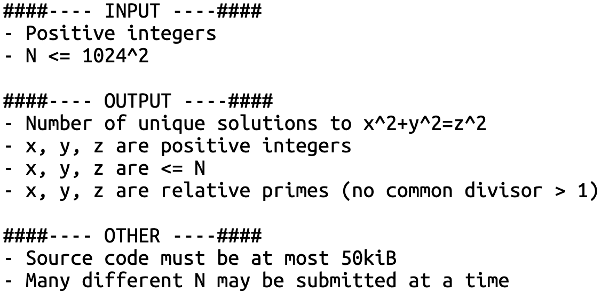

---

## Time measurements.
#### Timing
- Code is run using python3.7 using this **2012 laptop**.
- Best of **5 runs** for each algorithm and input.
- Increase problem size until set takes **>600 seconds**.
- **Discard** problem sizes with time **< 0.5 seconds**.
- Calculate **ETA using** time complexity estimation of **biggest 3 inputs**.
- e.g. `if size*2 -> time*8 then complexity=O(n^3)` because (2^3 -> 8).

#### Sources
- `github.com/isaacbernat/presentations/tree/master/optimise`
- Specific timings at `times.csv`.
- Summary, ratios and more at `timings.md`.
 
???

- The laptop **specs** can be found in the **github url**. Just a **new laptop** would probably be a **good speedup** ;D.
- Best of 5 runs (extra time is overhead from OS, etc).
- 600s should be big enough to provide robust numbers.
- Small times have higher variablity non dependent on algorithm.
- We don't have billions of years to wait and get result, but we want to compare different algorithms that are much faster and can't use the same input.

- Feel free to replicate the experiments. If on a different machine they may vary accordingly, but I think should be within the same order of magnitude?
optimise time, vs memory, a specific shared resource, etc.

---

## How good are you at estimating speedups?.
## https://tinyurl.com/pycon2019
### Results from the above form will be published in a few days. 
### How fast code is compared to the previous version?
#### current_time / previous_time. 
#### E.g. if the code now takes half the time it is 2x (1/0.5). If it takes 75% the original time it is 1.33x (1/0.75).
### Compare Python to Python but also PyPy to PyPy for extra fun!

---

## v0 Baseline.
### `ETA N=2^20:` 98.263 years `; ETA 100k N<=2^20:` >1 Bn

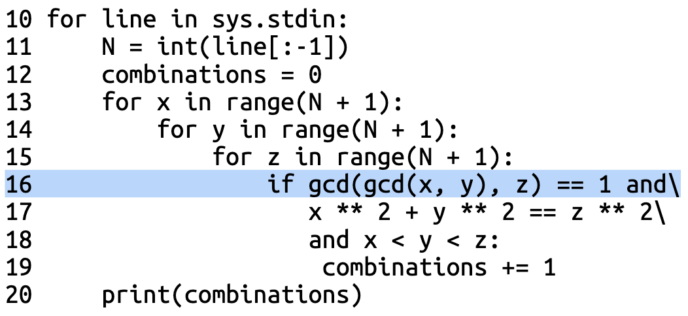

???

A naive solution would be something like the one above. One could have used a set and put all triplets in it instead of making x < y < z (to avoid repetitions) and then returning the length of the set. It felt more natural to me to add the check and use a counter, since only the amount is needed.

But before we evaluate how good/bad the code is... let's see how gcd is calculated, that's important too!

---

## v0 Baseline.

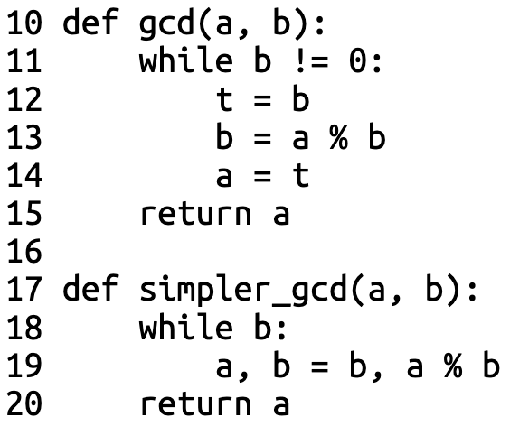

    
???

Well known Euclidean algorithm that does the job. The first version would probably be good enough and look reasonable for most cases, but it can be further simplified as we see below (and use less variables, assignments, etc).

---

## v1 Don't reinvent the wheel.

???

### ASK ABOUT TIME ESTIMATING SPEEDUP

Well known algorithm that does the job. The first version would probably be good enough for most cases, but it can be further simplified as we see below.

If the functionality needed can be found in a trusted library it's probably a good idea to try that first before reimplementing it (and not just for performance reasons).

---

## v2 Function specialisation.
### V1 vs V0 speedup: 1.61x

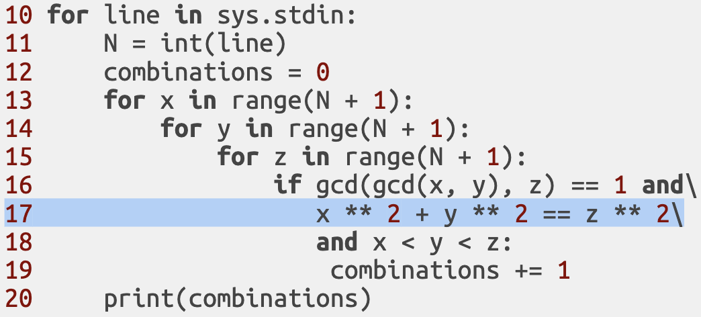

???
### ETA V1 N=2^20: 60.943 years

---

## v2 Function specialisation.

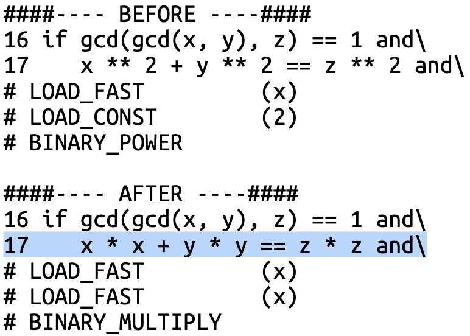

???

Overly generic functions tend to be more expensive than specific ones. 
- Exponentiation is generic and expensive.
- Squaring is specific and cheap.
- We can see the difference in CPython bytecode (more on that later)

---

## v3 Short-circuit evaluation.
### V2 vs V1 speedup: 2.19x

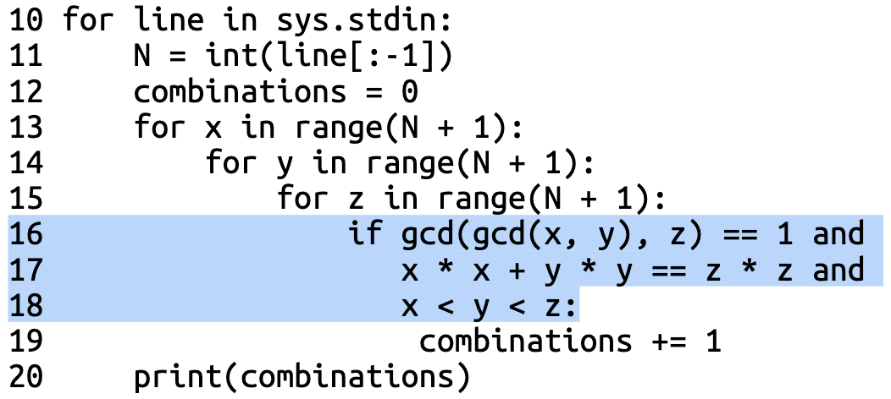

???
### ETA V2 N=2^20: 27.714 years

Arrange parameters so the ones more likely to fail (and/or cheaper to compute) are evaluated first (last in case of OR chains). Keep in mind that it may affect branch prediction on modern CPUs. 

Further references: https://docs.python.org/3/library/stdtypes.html#boolean-operations-and-or-not

---

## v3 Short-circuit evaluation.

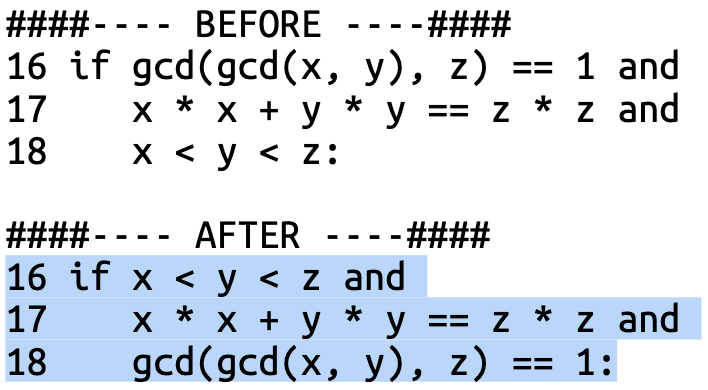

---

## v4 Search space reduction.
### V3 vs V2 speedup: 2.58x

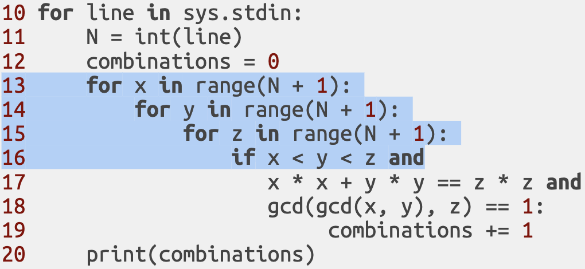

???
### ETA V3 N=2^20: 10.717 years

Avoid going through ranges we know won't satisfy the condition and enforce restrictions earlier (4b is a tiny refactor):

---

## v4 Search space reduction.

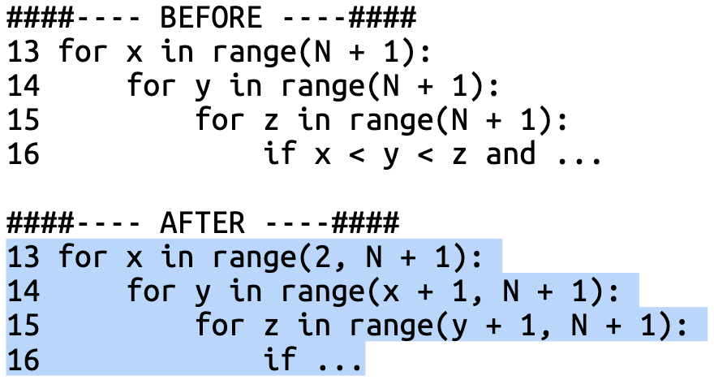

---

## v5 Code hoisting.
### V4 vs V3 speedup: 3.56x

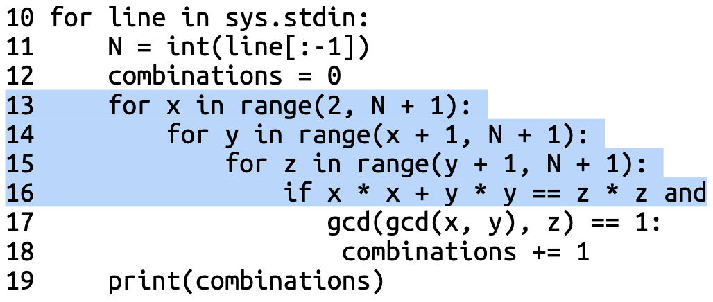

???
### ETA V4 N=2^20: 3012 years

Moving results of known calculations (invariants) outside loops.

---

## v5 Code hoisting.

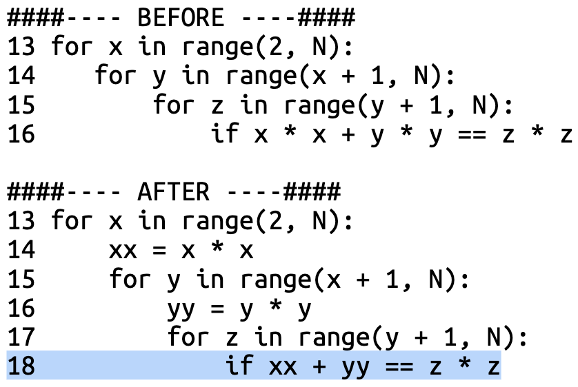

---

## v6 Function calls vs inline code.
### V5 vs V4 speedup: 1.83x

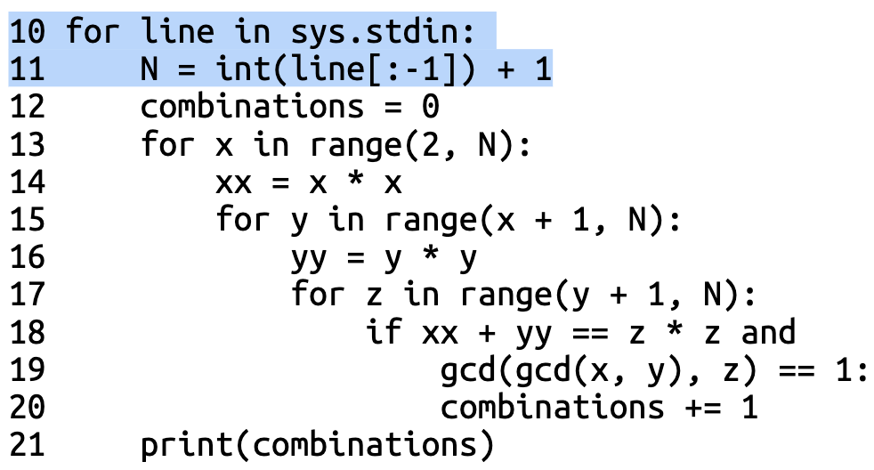

???
### ETA V5 N=2^20: 1647 years

This may not hold true in newer Python versions, but variables in functions load faster, and this makes the extra function call overhead negligible. Always measure instead of relying only in intuitions.

---

## v6 Function calls vs inline code.

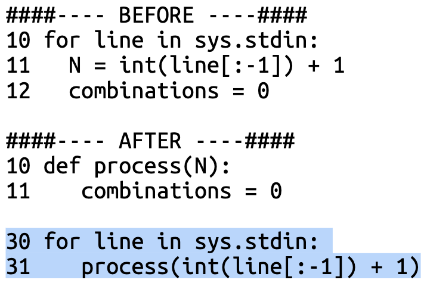

---

## v6 Function calls vs inline code.

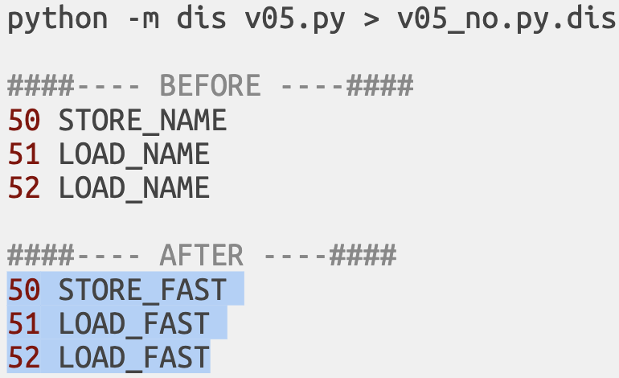

???

They make no guarantees that the transformation from Python code to the intermediate bytcode used by CPython will be compatible/the same between versions (implementation may change), so, use it at your own risk.

Apparently this behaviour has been true at least since 2014 in python 2.7 and is still true today (current version of python 3.7.4). 

References: 
- https://stackoverflow.com/questions/21107131/why-mesh-python-code-slower-than-decomposed-one
- https://docs.python.org/3/library/dis.html (the official disassembler package) 

---

## v7 Code specialisation
### V6 vs V5 speedup: 2.03x

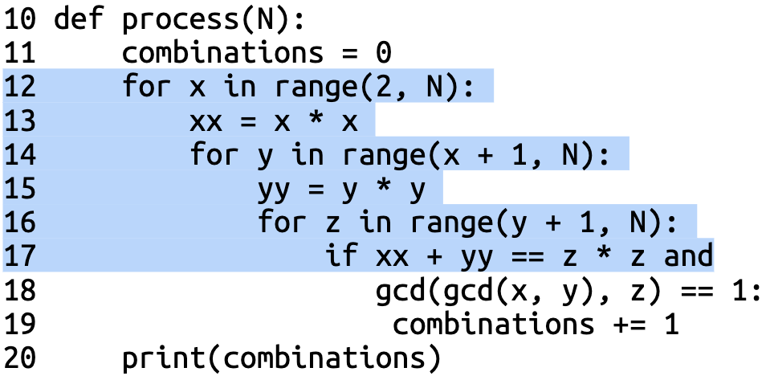

???
### ETA V6 N=2^20: 811 years

Problem-specific. We save 6/8 computations. Numbers must be coprimes. At most one number in the triplet can be pair. This let's us increment loops by 2 to keep variables either pair or odd as required.

---

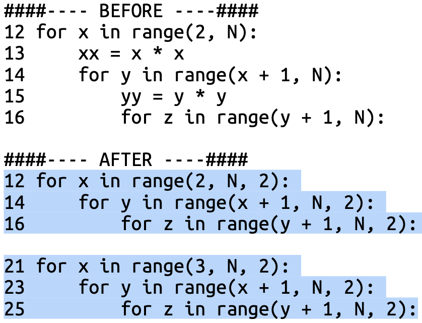

???

---

## TODO CONTINUE PYPY INTERLUDE-----------------
------------------------------------------------
-----------------------------------------------

---

## v8 Paradigm shift.
### V7 vs V6 speedup: 4.15x

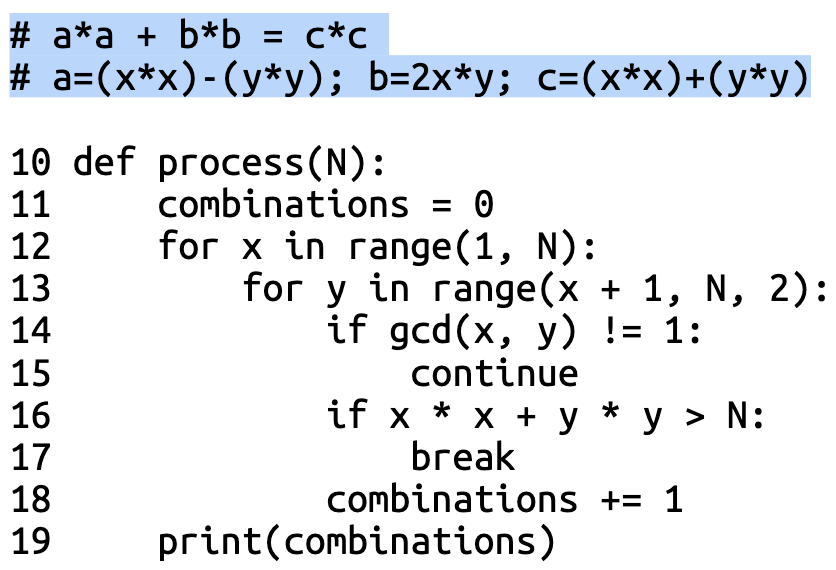

???
### ETA V7 N=2^20: 195 years. v0 was 98.263. That's >500x total!

Significant speedups can be achieved using non-incremental approaches. In this case we use a calculation based on Euclid's formula to generate primitive pythagorean triples.

---

## v8 Paradigm shift.

# TODO SPLIT PREVIOUS SLIDE INTO 2

???

Significant speedups can be achieved using non-incremental approaches. In this case we use a calculation based on Euclid's formula to generate primitive pythagorean triples.

---

## v9 Early loop termination.
### V8 vs V7 speedup: 9 172 593 998x; N=2^20: 1.1s (v7 ETA 195years)

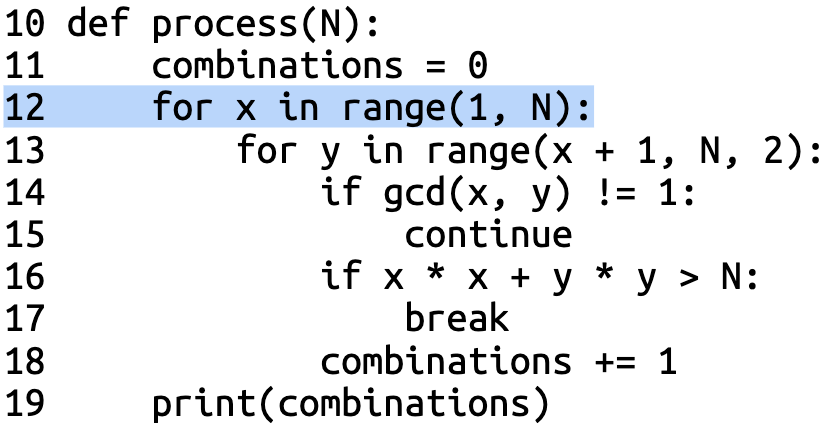

???
### V8 ETA 100k N>=2^20: 67.165s

Don't need to go all the way through N. TODO explain more

---

## v9 Early loop termination.

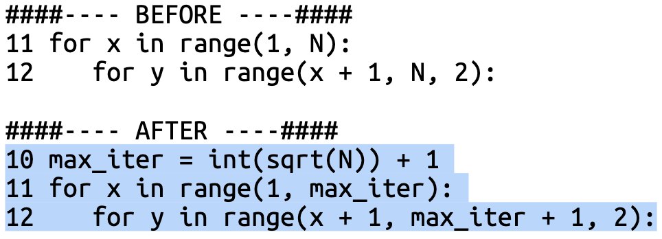

---

## v10 Expensive vs cheap ops.
### V9 vs V8 speedup: 14.82x

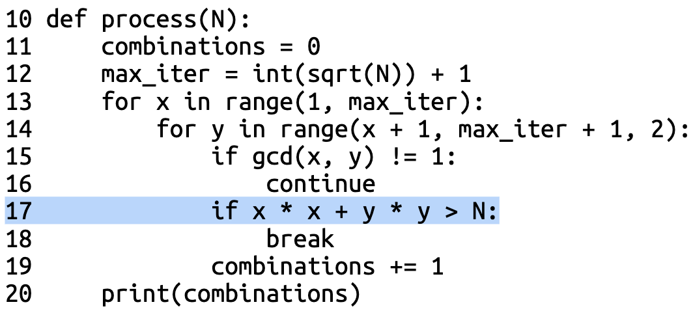

???
### V9 ETA 100k N>=2^20: 4531s

A few SQRTs can save many squares here.

---

## v10 Expensive vs cheap ops.

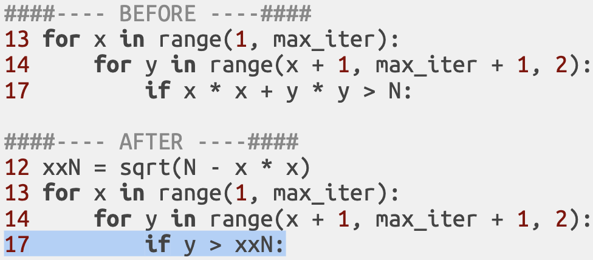

---

## v11 Mind types.
### V10 vs V9 speedup: 1.28x

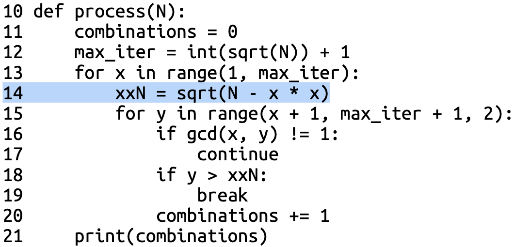

???
### V10 ETA 100k N>=2^20: 3531s

Avoid int to float castings in the loop. Even if it quacks like a duck, there are different kinds of ducks (i.e. implicit conversions).

---

## v11 Mind types.

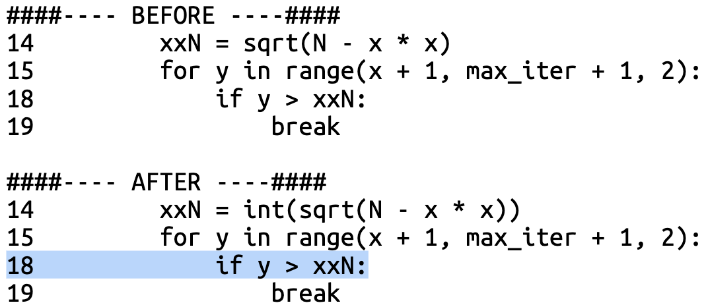

---

## Interlude: Profiling

#### Maximum possible speedup
- An optimisation may not speed up a program more than the time it takes.
- E.g. A part taking 33% of time will at most make the code 1.5x faster.
- Useful to choose where to focus on and if it's worth it.

#### github.com/vpelletier/pprofile

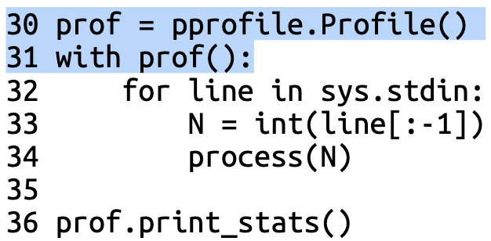

???
## TODO ask to Write previous speedup!

Previous speedup was... modest (<1%). Time measurement doesn't need to be a black box. Let's profile the code to see what to optimise next 

### Maximum possible speedup
- Mention Amdahl's law vs Gustafson's law? That only applied to parallel computing though...

References: Amdahl's law http://demonstrations.wolfram.com/AmdahlsLaw/

### pprofile
- it allows line-by-line (cProfile, python's standard granularity is functions)
- is deterministic (good for tasks that take few seconds)
- easy to install with pip and easy to use

---

## Interlude: Profiling

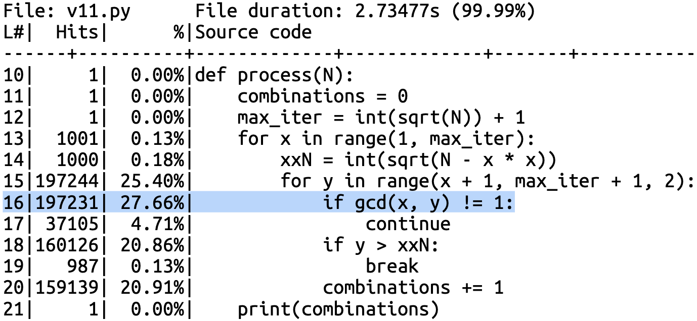

???

### statistical vs deterministic profilers?
- det: overhead (can't be used in prod)
### about 50x slower
### 2.73s vs ~0.06s; N=1024*1024
### 154s  vs  3.26s; 100 of 0 < N <= 1024*1024
- implemented in python. There may be less portable C versions with smaller overhead

- stat: needs long run time to be reliable
this profiles also supports statistical mode

---

## v12 Memoisation (without r, no typo here).
### V11 vs V10 speedup: 1.01x

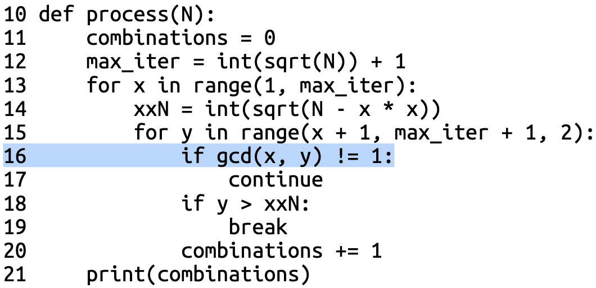

???
### V11 ETA 100k N>=2^20: 3513s

Avoid int to float castings in the loop. Even if it quacks like a duck, there are different kinds of ducks (i.e. implicit conversions).

---

## v12 Memoisation.

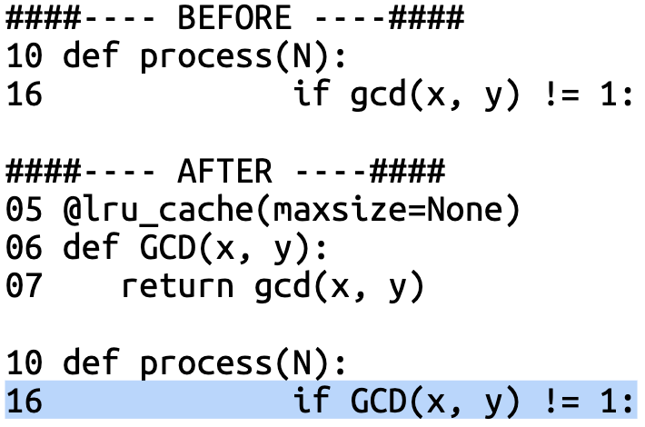

---

## v13 Reuse results.
### V12 vs V11 speedup: 0.81x

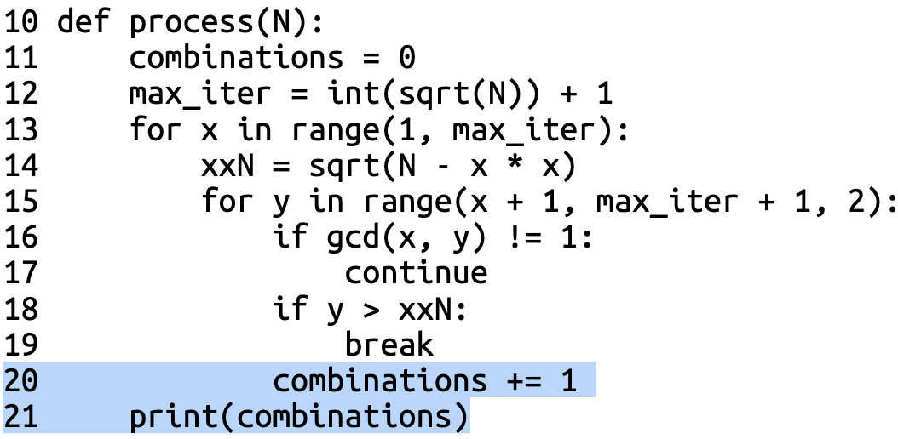

???
### V12 ETA 100k N>=2^20: 4297s

... but wait, in this case the lru_cache was actually more expensive than calculating it each time! We won't be adding that "optimisation" (also always remember to measure!)

---

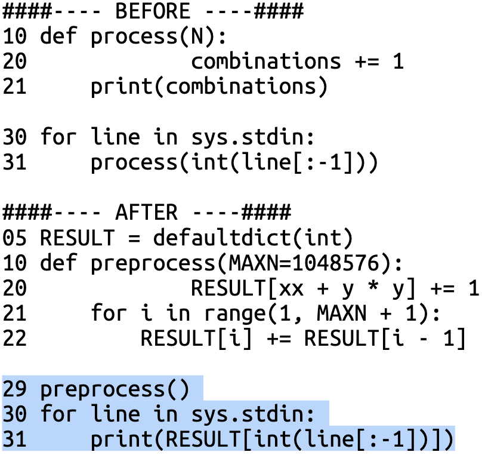

---

## v14 The end of a journey?
### V13 vs V12 speedup: 3978.92x

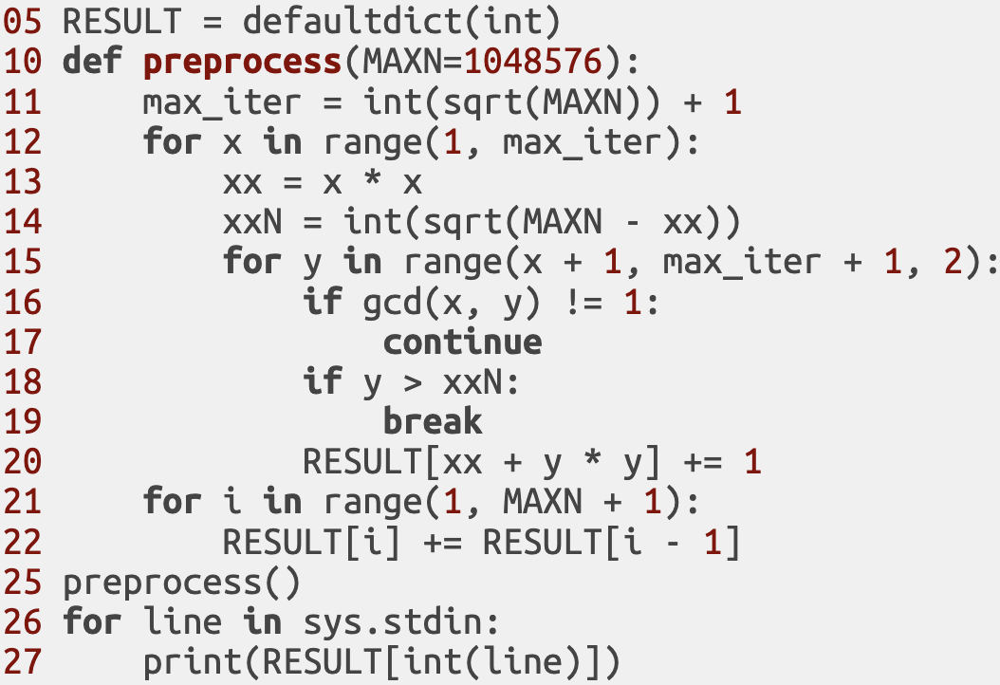

???

### V13 ETA 100k N>=2^20: 1.08s

... but wait, in this case the lru_cache was actually more expensive than calculating it each time! We won't be adding that "optimisation" (also always remember to measure!)

---

## TODOOOOO add 14 (C with optimisations)
python is simpler and shorter
 0.6 Kib vs  15 Kib
30 lines vs 140 lines
### Noteworthy C++ optimisations:
- threads
- vectorisation
- memoisation of GCD using chars (faster in C++ than python?)  # TODO CHECK
- smaller memory footprint (e.g. `chars` for `gcd(m, n) == 1`)
    - bithacks and masks has even smaller footprint!
- store RESULTS using 1/4 of memory, since they change at most %4
- `struct union` to reuse all memory allocated for `GCD == 1` for results, even when they have different data types.
    - 4 `char` -> 1 `int`, so it fits!
- read and store many input entries while still calculating the results (using threads).
- do so in bulk (128 entries at a time)
- reading/writing on a shared memory buffer simulataneously for a smaller memory footprint.

### non-noteworthy (compiler should do):
- do while (vs for loop)
- preincrement (vs postincrement, e.g. ++i vs i++)

???
Many other interesting techniques
- branch predictions
- conditional move vs if
- loop unrolling
- function inlining
- rematerialisation (vs code hoisting)
- and many more! (for fun check LEA for multiplications on x86)
