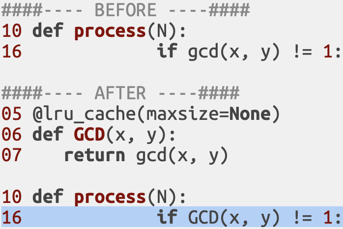

# From 1 > billion years to < 1 second

### Landing page, lifetime of earth? (TODO)
contact info? link to github? link to ivbar?

---

# Outline

### 15% Part 1 Why bother?
### 50% Part 2 Problem definition, time measurement.
### 35% Part 3 Optimisations.
### 35% Part 4 Conclusions.

The % is the approximate relative duration.

???
- This is how the presentation is structured.
- Within each section I will advance **chronologically**.

---

## Problem definition
### Input
- Positive integers
- N <= 1024^2

### Output
- Number of unique solutions to x^2+y^2=z^2
- x, y, z are positive integers
- x, y, z are <= N
- x, y, z are relative primes (no common divisor > 1)

### Other
- Source code must be at most 50kiB
- Many different N may be submitted at a time (e.g. 100)

---

## v0 Baseline.

???

A naive solution would be something like this. It could be improved, but it's not horrible right? I mean, it even uses a **counter** with the result **instead of adding all the triplets to a list** and returning the length of that.

But before that... let's see how gcd is calculated

---

## v0 Baseline.

    
???

Well known Euclidean algorithm that does the job. The first version would probably be good enough for most cases, but it can be further simplified as we see below.

---

---

## Intelude: measurements.

## TODO
 
???

todo
optimise time, vs memory, a specific shared resource, etc.

---

## v1 Don't reinvent the wheel.

???

Well known algorithm that does the job. The first version would probably be good enough for most cases, but it can be further simplified as we see below.

If the functionality needed can be found in a trusted library it's probably a good idea to try that first before reimplementing it (and not just for performance reasons).

---

## v2 Function specialisation.  
### V1 vs V0 speedup: 1.61x; 

---

## v2 Function specialisation.

#### TODO display some disassembly snippets to show that the generated code is quite different

???

Overly generic functions tend to be more expensive than specific ones. 
- Exponentiation is generic and expensive.
- Squaring is specific and cheap:

---

## v3 Short-circuit evaluation.
### V2 vs V1 speedup: 2.19x

???

Arrange parameters so the ones more likely to fail (and/or cheaper to compute) are evaluated first (last in case of OR chains). Keep in mind that it may affect branch prediction on modern CPUs. 

Further references: https://docs.python.org/3/library/stdtypes.html#boolean-operations-and-or-not

---

## v3 Short-circuit evaluation.

---

## v4 Search space reduction.
### V3 vs V2 speedup: 2.58x

???

Avoid going through ranges we know won't satisfy the condition and enforce restrictions earlier (4b is a tiny refactor):

---

## v4 Search space reduction.

---

## v5 Code hoisting.
### V4 vs V3 speedup: 3.56x

???

Moving results of known calculations (invariants) outside loops.

---

## v5 Code hoisting.

---

## v6 Function calls vs inline code.
### V5 vs V4 speedup: 1.83x

???

This may not hold true in newer Python versions, but variables in functions load faster, and this makes the extra function call overhead negligible. Always measure instead of relying only in intuitions.

---

## v6 Function calls vs inline code.

---

## v6 Function calls vs inline code.

???

They make no guarantees that the transformation from Python code to the intermediate bytcode used by CPython will be compatible/the same between versions (implementation may change), so, use it at your own risk.

Apparently this behaviour has been true at least since 2014 in python 2.7 and is still true today (current version of python 3.7.4). 

References: 
- https://stackoverflow.com/questions/21107131/why-mesh-python-code-slower-than-decomposed-one
- https://docs.python.org/3/library/dis.html (the official disassembler package) 

---

## v7 Code specialisation
### V6 vs V5 speedup: 2.03x

???

Problem-specific. We save 6/8 computations. Numbers must be coprimes. At most one number in the triplet can be pair. This let's us increment loops by 2 to keep variables either pair or odd as required.

---

???

---

## TODO CONTINUE PYPY INTERLUDE-----------------
------------------------------------------------
-----------------------------------------------

---

## v8 Paradigm shift.
### V7 vs V6 speedup: 4.15x

???

Significant speedups can be achieved using non-incremental approaches. In this case we use a calculation based on Euclid's formula to generate primitive pythagorean triples.

---

## v8 Paradigm shift.

# TODO SPLIT PREVIOUS SLIDE INTO 2

???

Significant speedups can be achieved using non-incremental approaches. In this case we use a calculation based on Euclid's formula to generate primitive pythagorean triples.

---

## v9 Early loop termination.
### V8 vs V7 speedup: 9 172 593 998x

???

Don't need to go all the way through N. TODO explain more

---

## v9 Early loop termination.

---

## v10 Expensive vs cheap ops.
### V9 vs V8 speedup: 14.82x

???

A few SQRTs can save many squares here.

---

## v10 Expensive vs cheap ops.

---

## v11 Mind types.
### V10 vs V9 speedup: 1.28x

???

Avoid int to float castings in the loop. Even if it quacks like a duck, there are different kinds of ducks (i.e. implicit conversions).

---

## v11 Mind types.

---

# PROFILERS INTERLUDE. TODO!!!

???

Previous speedup was... modest (<1%). Time measurement doesn't need to be a black box. Let's profile the code to see what to optimise next (maybe introduce Amdah'ls law here? And gustafson-barsis instead of a longer theoretical intro?). (talk about statistical vs deterministic profilers?)

---

## v12 Memoisation (without r, no typo here).
### V11 vs V10 speedup: 1.01x

???

Avoid int to float castings in the loop. Even if it quacks like a duck, there are different kinds of ducks (i.e. implicit conversions).

---

## v12 Memoisation.

---

## v13 Reuse results.
### V12 vs V11 speedup: 0.81x

???

... but wait, in this case the lru_cache was actually more expensive than calculating it each time! We won't be adding that "optimisation" (also always remember to measure!)

---

---

## v14 The end of a journey?
### V13 vs V12 speedup: 3978.92x

???

... but wait, in this case the lru_cache was actually more expensive than calculating it each time! We won't be adding that "optimisation" (also always remember to measure!)

--

## TODOOOOO add 14 (C with optimisations)
