# From 1 > billion years to < 1 second

"An algorithm must be seen to be believed" - *Donald Knuth, 1968*

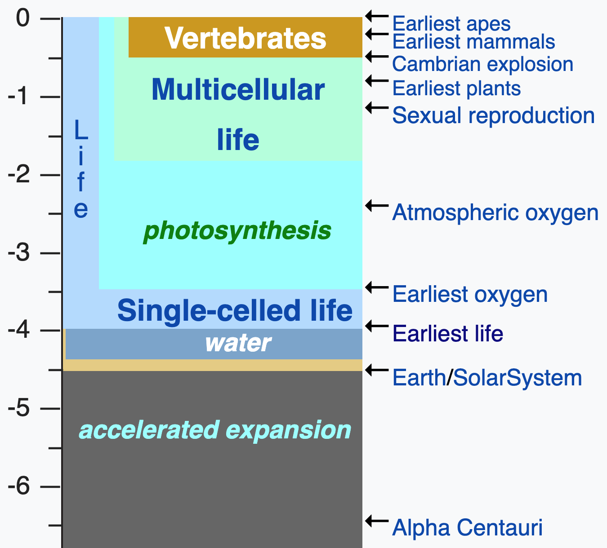

???

## Context 5 billion years
Good morning! I choose this image of the timeline of Earth to put things in context. 5 billion years is a long time... Way too long to wait for a computation to finish.

## With this 2012 laptop and Python it will become <1 second
Today I am going to present an algorithm in Python3 that takes longer than the existence of the Solar System in this 2012 laptop. I am going to show a dozen optimisation techniques to create an equivalent Python3 program that takes less than 1 second.

## Code is usable for real and public in github.
But rather than just describing them in abstract, I am going to apply them incrementally, so one can see they are effective, can be used together and are adaptable to real problems. All the code and results is in a public github repository for anybody to verify.

Let's move on!

---

## Problem definition.

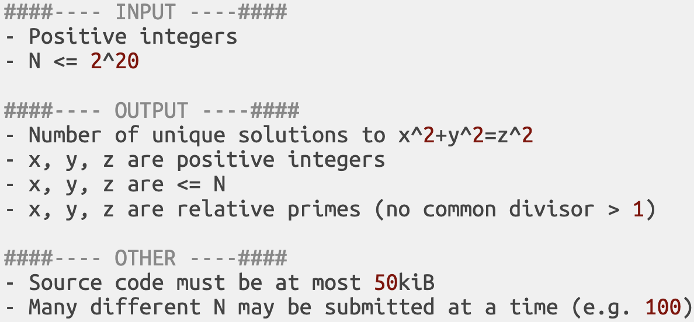

???
## Simple: read an integer and write an integer.
The input consists of positive integers up to 1.05M

## Output: read the list.
Emphasis on UNIQUE equation solutions.

## No precalculation
There is a strict limit on the source size. Precalculating 1M results and simply printing them is not a valid "fast solution".

## Size of input
To simplify we will only consider N=2^20 at the beginning, but later we will assume the input to be 100k random numbers < 2^20.

---

## Solutions (first 48 samples).

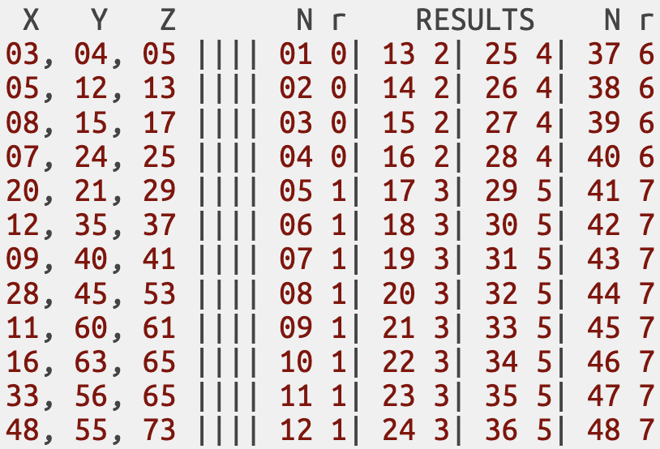

???
A sample of the first 50 solutions will probably help make the previous description easier to understand.

## Columns X, Y, and Z
They represent the unique triplets which fulfill all the restrictions we described previously. Sorted by number, from small to large.

## Result columns. N -> input; r -> result
When N is < 5 the result is 0. We can see no triplet exists with a Z smaller than 5. The next triplet has Z = 13. That means the result from 5 to 12 will be 1. And so on.

Here one can see a pattern 4...8...4...8... but it gets more complicated after 48

---

## Time measurements.
#### Timing
- Code is ran using python3.7 on a **2012 laptop**.
- Best of **5 runs** for each algorithm and input.
- Increase problem size until set takes **>600 seconds**.
- Calculate **ETA using** time complexity estimation of **biggest 3 inputs**.
- e.g. `if size*2 -> time*8 then complexity=O(n^3)` because (2^3 -> 8).
    - N=100, t=1min
    - N=200, t=8min
    - N=400, t=64min

#### Sources
- `github.com/isaacbernat/presentations/tree/master/optimise`
- Specific timings at `times.csv`.
- Summary, ratios and more at `timings.md`.

???
## Specs and details on github
- More complete details on the laptop specs and how I measured the time are available in a public github repository, along with the code.

## Complexity esimation
- But before I go on, one may wonder how I estimated times greater than years. I calculated the biggest N possible under 10 minutes and then I interpolated the result with the 3 previous biggest Ns. For example:
    - N=100, t=1min;
    - N=200, t=8min;
    - N=400, t=64min;

We could infer that N X 2 -> t X 8;. That would be a cubic complexity. It would be linear if N X 2 -> t X 2, but this case the relation is bigger than that. For each different version we calculate the progression and scale it up to N=2^20 and then 100k Ns

PD: Yes, I know, one easy speedup would be getting a new laptop ;D

## More details below
- The laptop **specs** can be found in the **github url**. Just a **new laptop** would probably be a **good speedup** ;D.
- Best of 5 runs (extra time is overhead from OS, etc).
- 600s should be big enough to provide robust numbers and minimise the noise.
- We don't have billions of years to wait and get result, but we want to compare different algorithms that are much faster and can't use the same input.
- Feel free to replicate the experiments. If on a different machine they may vary accordingly, but I think should be within the same order of magnitude?
optimise time, vs memory, a specific shared resource, etc.

---

## How good are you at estimating speedups?.
## https://tinyurl.com/pycon2019
### Results from the above form will be published in a few days.
### How fast code is compared to the previous version?
#### current_time / previous_time.
#### E.g. if the code now takes half the time it is 2x (1/0.5). If it takes 75% the original time it is 1.33x (1/0.75).
### Compare Python to Python but also PyPy to PyPy for extra fun!

???
Before we start reading code, to make it a better learning experience, I'd suggest you to either go to that URL and fill the form as we go or to take a piece of paper and write down notes. I'd like you to estimate the magnitude of the speedup for each optimisation introduced relative to the previous code. You can assume we are using the latest Python and/or PyPy.

The way to write it is the following (E.g. if the code now takes half the time it is 2x (1/0.5). If it takes 75% the original time it is 1.33x (1/0.75).)

## Alt: piece of paper
If you don't want to use the url above, even a piece of paper can be fun. But then it will be harder for other people to compare to you :P

---

## v0 Baseline.
### `ETA N=2^20:` 98 263 years `; ETA 100k*N<=2^20:` >1 Bn

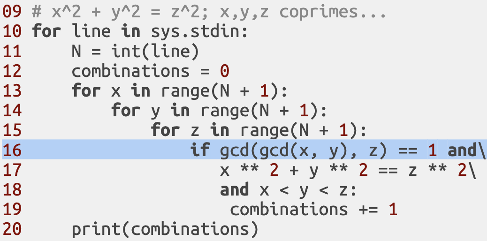

???

Let's begin! The execution for this code is around 100k years for N=2^20. Definitely more than 1 Billion years for 100k random Ns.

A naive solution would be something like the one we see. We go through all X, Y and Z up to N and for each check that they are coprime, their square sums follow the equation and that X < Y < Z.

That last part is to avoid repetitions, since swapping X for Y the equation would still be valid but we don't want to count that. We could have also put the triplets in a set and simply do `len()`on it. Consider this already an optimisation if you may. We are only interested in the amount no which exact triplets.

But before we evaluate how good/bad the code is... we need to see it all, right? How is gcd (Greatest Common Divisor) calculated?

---

## v0 Baseline.

???
## Euclidean Algorithm
The classic algorithm does the job. In this example we use the first version with a temporary variable, which is not as efficient the second, but good enough for our case.

---

## v1 Don't reinvent the wheel.
### V0 vs V0 speedup: 1.00x; &emsp; &emsp; V0 -> 98 263 years (N=2^20)

???

# v1
If the functionality needed can be found in a trusted library, it's a good idea to try that before considering reimplementing it (and not just for performance reasons).

### ASK ABOUT TIME ESTIMATING SPEEDUP

---

## v2 Peephole optimization/strength reduction.
### V1 vs V0 speedup: 1.61x; &emsp; &emsp; V1 -> 60 943 years (N=2^20)

???
This technique is about replacing overly generic functions by more specific ones. For example in binary integer arithmetic, we know that multiplication by a power of 2 can be expressed as a simple "shift" operation. E.g. multiplication by 16 (2^4) means moving 4 bits to the left. For most architectures this is computed faster.

---

## v2 Peephole optimization/strength reduction.

???

The affect code is highlighted:
- Exponentiation is generic and expensive.
- Squaring is specific and cheap.
- We can see the difference clearly in CPython bytecode (more on that later), the most significant change being POWER vs MULTIPLY

---

## v3 Short-circuit evaluation.
### V2 vs V1 speedup: 2.19x; &emsp; &emsp; V2 -> 27 714 years (N=2^20)

???
As we can see, the exponentiation is replaced by multiplication now.

From a logic point of view, the order does not matter. But most computers execute code sequentially. That is, one condition must be evaluated first, then a second one and so on. If the first results false, the next one doesn't need to be evaluated as the whole condition will be False. If the first is True then the second one needs to be evaluated. The reverse process would be applicable for chained OR conditions.

Further references: https://docs.python.org/3/library/stdtypes.html#boolean-operations-and-or-not

---

## v3 Short-circuit evaluation.

???
Short-circuiting consists on arranging parameters so the ones more likely to fail (and/or cheaper to compute) are evaluated first (last in case of OR chains). Keep in mind that it may affect branch prediction on modern CPUs.

In our example we move the expensive gcd to the end and the cheap integer comparison first.

---

## v4 Search space reduction.
### V3 vs V2 speedup: 2.58x; &emsp; &emsp; V3 -> 10 717 years (N=2^20)

???
A way to speed up code is to avoid checking conditions that we know beforehand are not going to be satisfied. Here we are going to avoid going through ranges partially by enforcing restrictions earlier.

---

## v4 Search space reduction.

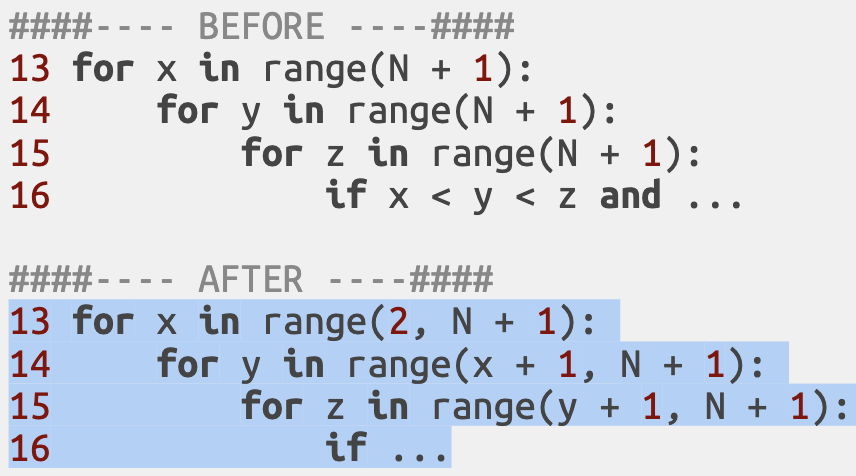

???

In our case we want Y > X and Z > Y. We can start the ranges with those initial values instead of 0. This way we avoid many comparisons that we know will be false.

---

## v5 Code hoisting.
### V4 vs V3 speedup: 3.56x; &emsp; &emsp; V4 -> 3 012 years (N=2^20)

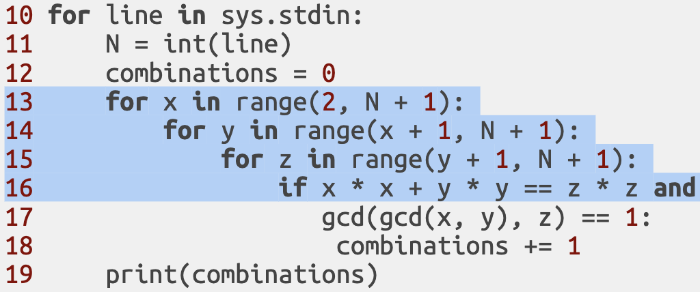

???
Similar to previous optimisation, this one consists on moving calculations that we know will not change within a loop outside. These kind of expressions are known as invariants.

---

## v5 Code hoisting.

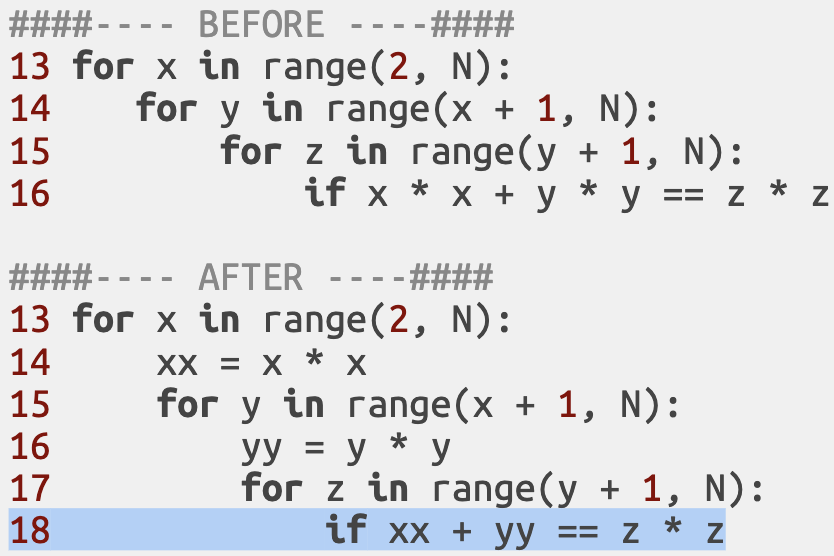

???

As long as Y does not change, Y x Y won't change too. Same reasoning may be applied for X.

---

## v6 Function calls vs inline code.
### V5 vs V4 speedup: 1.83x; &emsp; &emsp; V5 -> 1 647 years (N=2^20)

???
Programs are divided into scopes. Every time a function is called there is a context change. Part of the current state needs to be saved and not affected by "code executed in function". Usually all this is kept in a stack in memory that needs to be restored when the function returns. But talking about the details here is out of the scope (pun intended ;D). The point is that each function call incurs overheads.

---

## v6 Function calls vs inline code.

???

In our case the change is to make the calculation of N be a function instead of part of the "main" script code. A side-effect is that it makes the code more structured and readable too.

---

## v6 Function calls vs inline code.

???

No guarantees are made that the transformation from Python code to the intermediate bytcode used by CPython will be compatible/or the same between versions (implementation may change), so keep that present. Here we see that STORE_NAME and LOAD_NAME are replaced by STORE_FAST and LOAD_FAST using the `dis` disassembler package. This change has implications on execution time that may or may not compensate the extra function call overhead. What do you think? Always measure instead of relying in intuitions only.

Apparently this `dis` behaviour has been true at least since 2014 in python 2.7 and is still true today (current version of python 3.7.4).

References:
- https://stackoverflow.com/questions/21107131/why-mesh-python-code-slower-than-decomposed-one
- https://docs.python.org/3/library/dis.html (the official disassembler package)

---

## v7 Code specialisation
### V6 vs V5 speedup: 2.03x; &emsp; &emsp; V6 -> 811 years (N=2^20)

???
An approach similar to strength reduction. We will split the loop which calculates everything into two that do less but more specific work.

---

???
One condition that must be fulfilled is that X, Y and Z must all be co-prime. That means that at most one number in any given triplet can be even (i.e. divisible by 2). This let's us increment loops by 2 to keep variables either always even or odd as required.

---

## Interlude: Compilers
### V7 vs V6 speedup: 4.15x; &emsp; &emsp; V7 -> 195 years (N=2^20)

### PyPy
- JIT (just in time). Can take into account real-time usage data.
- Replace `"python3"` with `"pypy3"`
- Many other "python-based" options are avialable: e.g. Numba, Cython...

### C++ 17
- Can be close to the machine.
- Tried to be faithful when porting Python to keep comparisons fair.
- `clang` comparable in performance to `g++` (from GNU Compiler Collection).
- Flags used `"-O0"` and `"-O3"`.

???
The real speedup is quite close to the theoretical one. We saved 6/8 iterations and that means it would do 25% of the calculations. That would be 4x speedup.

### Definition
Compilers are programs which translate a source language (e.g. python) into another (e.g. bytecode). They also can apply optimisations, analysing the whole source code and how it behaves.

PyPy is just one of many tools to speedup python execution. This presentation is already quite long so we won't be covering them.

## C++
- I added ports to C++ to compare along with PyPy because it's a popular language that can get quite close to machine code and is used were performance is critical. C++ may be better suited than Python for some tasks. It's worth comparing if it's the case here.
- Many more optimisation flags could be applied beyond the -O0 and -O3, but I wanted to keep it simple and close to the original python code.

---
<embed style="margin-left:-2rem" src="plots/plot_eta7.html" width="110%" height="100%"></embed>

???
# TODO rewrite comments to match updated plot
Now that we've introduced what to compare Python3 to, let's see how we did. We went from N=2^20 = 100k years (v0) to under 200 years (v7). That's a total 500x speedup. Not bad right?

We see the C++ port without optimisation flags is about as fast as PyPy in these examples. Using -O3 makes it about twice as fast as them.

Just running v0 with PyPy instead of Python3 we already get a 10x speedup. Quite nice but far from 500x we achieved. The "magic" comes in v3, when C++ and PyPy plots disappear.

---
<embed style="margin-left:-2rem" src="plots/plot_speedup7.html" width="110%" height="100%"></embed>

???
Here we have a similar plot with speedups. We see v3 (shortcircuit evaluation) has a huge impact >100x for PyPy and >200x for C++ -O3 compared to their previous O3 and PyPy versions respectively. Compared to Python3 v0 would be 1300x and 7300x respectively already!

We got a nice 2x for Python, but... gets dwarved next to it. So much we need to zoom in to actually see it. Why the big difference? Well, because compilers are quite clever at optimising code and can take a bigger advantage.

That's also why v1-v2 (change exponentiation to multiplication) and v4-v5 (moving the calculations outside the loops) are big gains for CPython but measly gains for PyPy and C++. The compilers were already similar optimisations.

---

## v8 Paradigm shift.

### V7 vs V0 speedup: 503x; &emsp; V0->98 263y; V7->195y (N=2^20)

???

We saw Python3 went from 100k years to 200. A 500x speedup. v7 in C++ O3 would take 1.4 years. That's a 70.000x speedup! But we can do better!

People tend to get attached to code, and there is a limit on how one can improve an algorithm incrementally. There is this sunk cost fallacy which prevents people from discard something and starting from scratch. That would be recognising "wasted effort" and that can be hard to accept.

"Paradigm shift" or "full rewrite" would both describe this approach. In our case this algorithm is based on Euclid's formula to generate primitive pythagorean triples and is quite different (read formula out loud here).

Being so different also makes speedup estimation harder but try anyway, it's fun ;D

---

## v9 Early loop termination.

### V8 vs V7 speedup: 9 172 593 998x; &emsp; V8 -> 1.1 seconds (N=2^20)

???
9Bn x speedup. The rewrite was well worth it :D

Now calculating N=2^20 seems too easy. From now on the problem will be calculating 100k random N from 0 to N=2^20. To make the comparisons fair, the seed which calculates the random numbers will be the same for all versions, so efectively all versions will be tested against the same input

How can we top that? Terminating a loop early, when we know a condition will not be fulfilled is what this optimisation consists on.

---

## v9 Early loop termination.
### V8 vs V7 speedup: 9 Bn; &emsp; &emsp; V8 -> 67 165 sec (100k N<=2^20)

### `(x*x) + (y*y) <= N`

???

We know that `(x*x) + (y*y)` must be smaller than N. Therefore making the number of iterations for X or Y upper bound to `sqrt(N)` will yield the same results, because all iterations with Y or X bigger than max_iter won't be valid.

`sqrt(N) * sqrt(N) = N`. We could even make `max_iter` even tighter, because X can be at most half of that, but saving these computations is already enough to showcase this optimisation. How big of a speedup to you estimate?

---

## v10 Expensive vs cheap ops.
### V9 vs V8 speedup: 14.82x; &emsp; &emsp; V9 -> 4 531 sec (100k N<=2^20)

???

Replacing an operation for another is not always obvious there will be a gain, like the case of strength reduction changing exponentiation by multiplication.

---

## v10 Expensive vs cheap ops.

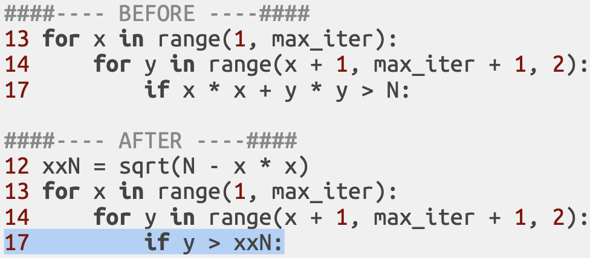

???
Here we combine code hoisting with strength reduction and replace a few SQRTs which are expensive operations to save many cheap ones like additions and multiplications.

---

## v11 Mind types.
### V10 vs V9 speedup: 1.28x; &emsp; V10 -> 3 531 sec (100k N<=2^20)

???
1.28x... not as big as other speedups we've seen. Let's see if we can do better.

Python is known for duck typing. That means that 2 different types with a suitable properties/methods will be treated the same way. But even if it quacks like a duck, there are different kinds of ducks (i.e. implicit type conversions).

---

## v11 Mind types.

???

Y, the results from range are integers. xxN, the result of a SQRT is a floating point number. Integers can be compared to floating point numbers, but there is a conversion that must be performed (even if implicit). Otherwise is comparing apples to pears (or apples to oranges if you prefer).

If we make the conversion explicit and we hoist it outside of the loop we will be saving a conversion every iteration.

Ok, how fast do we get now?
---

## Interlude: Profiling
### V11 vs V10 speedup: 1.01x &emsp; V11 -> 3 513 sec (100k N<=2^20)

#### Amdahl's law*
- The non-optimised part sets an upper bound on speedup.
- Fragments which take 1/3 of time will NEVER be faster than 1.5x.
- Useful to choose where to focus on and the potential upside.

???
Previous speedup was... modest (<1%). Time measurement doesn't need to be a black box. We can determine the upper bound of an optimisation before actually coding and testing it. For that we will use profilers. They can be invaluable to find what to optimise next.

### Amdahl's law
- The original Amdahl's quote is about parallellisable code, but the same principle can be applied here.

- Won't mention Amdahl's law vs Gustafson's law, the presentation is already too long...
References: Amdahl's law http://demonstrations.wolfram.com/AmdahlsLaw/

### pprofile
- easy to install with pip and easy to use. Just adding the code to be profiled as a context manager, as seen in the screen is enough.
- it allows line-by-line profiling (cProfile, python's standard granularity is functions. Too broad for us).
- has a deterministic mode (good for tasks that take few seconds). Also a statistical one.

---

## Interlude: Profiling

### `github.com/vpelletier/pprofile`

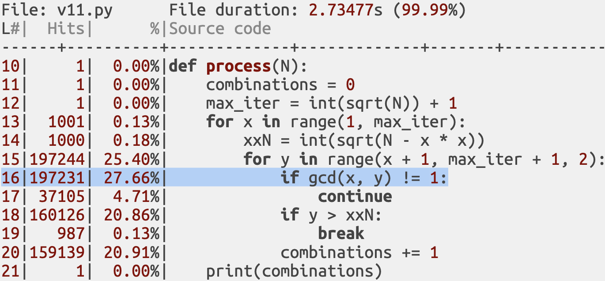

???
The github link above is the public repository where you can find the source code for pprofile.

The image shown is a simplified output, but enough to see how it works. For example, line 16 takes 27% of the runtime. That is checking if X and Y are coprime. That's the line where most time is spent, therefore a good candidate to be optimised!

Before we go on, a brief comment on
### statistical vs deterministic profilers
- det: have big overheads. Therefore are not suitable for production.
In our case the profiled code becomes 50x slower. With N = 2^20 the code took 0.06s, while profiled 2.73s. For 100 random Ns it went from 3.26s to 154s.

- stat: needs long run times to be reliable. At fixed intervals evaluates what part of code is being run.

---

## v12 Memoisation (without r, no typo here).

### V11 vs V10 speedup: 1.01x &emsp; V11 -> 3 513 sec (100k N<=2^20)

???
Memoisation (without R) consists on storing the results of expensive computations (e.g. function calls) and return the cached version when the same input occurs again.

---

## v12 Memoisation.

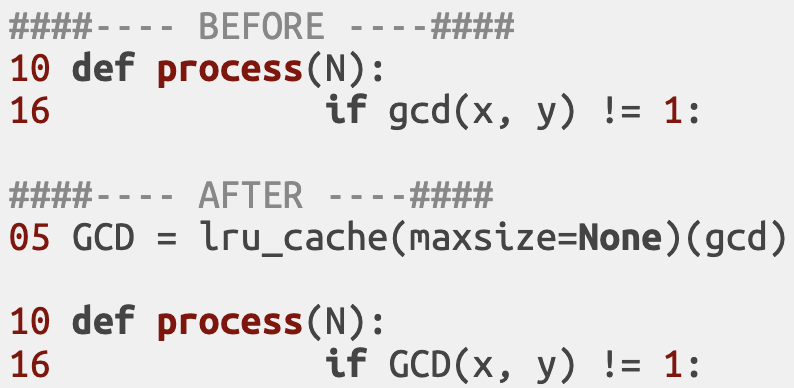

???
In our case we know the input consists of 100k random numbers up to N=2^20. Therefore we know most pairs of primes will be evaluated thousands times. An efficient cache should be able to write once and retrieve these values faster than it takes to compute the GCD (Greatest Common Divisor) again and again.

`functools` provides this handy decorator `lru_cache` that we are going to use to store the results of the memoised GCD instead of implementing our own solution (a simple dictionary would work).

---

## v13 Reuse results.
### V12 vs V11 speedup: 0.81x; &emsp; V12 -> 4 297 sec (100k N<=2^20)

???
... using that cache is actually slower than re-calculating each time the GCD!

One possibility is that the info we wanted to store was too big and couldn't fit in the lower level caches. When an operation looks for information in a cache but is not there, the extra cost to go to a higher level cache (processors often have several levels) or main memory is >10x slower than the initial reading cost.

A workaround for that would be to memoise only a subset of GCDs, those combinations of numbers which were the most costly to computations. But maybe this means that GCD was simply not expensive enough to be worthy of memoisation... In any case, we won't be adding this one to our code, since it would slow it down!

Always remember to measure instead of relying on intuition alone!

But there are more partial computations which are expensive and are recalculated thousands of times, since the input is 100k random Ns. That's what we try to fix here.

---

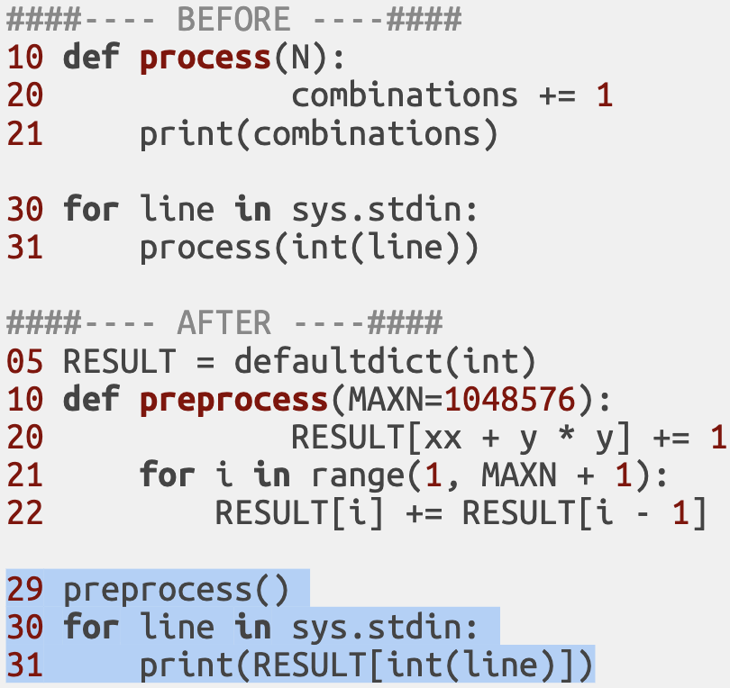

???

Instead of calculating the result every time on demand, we are going to calculate all possible results from 0 to 2^20 and store them in a cache. But that would be calculating 1M results, which is more than the 100k random initial numbers. That will be more expensive to calculate you may say!

But if we reuse the partial results in a clever way we can simply calculate ONCE the value for 2^20. Instead of having a variable to acumulate the number of combinations, we store each new combination on a dictionary corresponding to the current value of N we are iterating. At the end we calculate N by adding all the values from 0 up to N. For example for N=5 we would have added N=4 + N=5. But N=4 would be N=3 + N=4. And so on.

Does this make sense? I hope so, because now I would ask you to estimate a speedup ;D

---

## v14 Reduce memory footprint.
### V13 vs V12 speedup: 3979x; &emsp; V13 -> 1.08 sec (100k N<=2^20)

???
4000x, that was a nice speedup. Why is so? Basically because now the algorithm has a cost which is relatively constant. It does not depend too much on the size of N. We are always calculating 1.05M anyway. One would even be tempted to call the cost constant.

Calculating 100 values or 1000 has approximately the same cost, as the same amount of computations is required. There is still an overhead of I/O, reading and writing results, reading and writing memory, etc. but the cost of reading 1000 values from a dictionary is small compared to the computational cost of calculating those results 1000 times. This is why the speedup is so great. If we only wanted to calculate only one or a few small Ns this solution would actually be much slower, not faster.

Therefore we are going to focus on using less memory if possible. When the processor asks for a memory position, it not only gets the position asked, but also the ones that are adjacent. This is because of the principle of data locality which states that memory positions tend to be accessed sequentially (e.g. when iterating an array). Using less memory will make our arrays more likely to fit in lower level caches.

---

## v14 Reduce memory footprint.

???
Ok, the theory on why we want to do that is clear, but... how do we actually achieve it? These triplets have an interesting property. If we recall when we checked the solution samples at the beginning, we noticed a pattern. A simple version of that pattern holds true, and that is that the number of triplets only can change every 4 increases of N. That is, possible number of combination changes are N=1,5,9,13,17,21...

With that information we can save 75% of memory usage. How much of that will that translate into speedup and saved time?

---

### *The end?* &nbsp; V14 speedup: 1.77x; V14 -> 0.61 sec (100k N<=2^20)

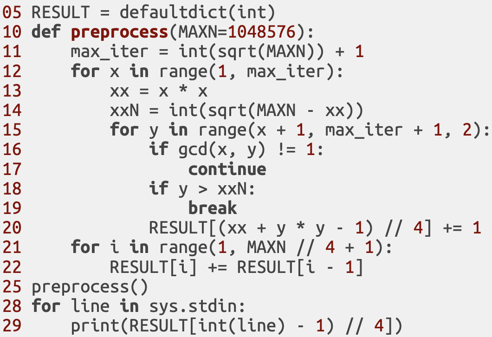

???
### V14.py  ETA 100k N>=2^20: 0.61s <-python
### V14.py  ETA 100k N>=2^20: 0.49s <-pypy
### V13.cpp ETA 100k N>=2^20: 0.05s <-O3

We've been going on for a while. This is how the code looks like now (minus blank spaces). So there was a price to pay to get faster runtimes after all. Apart from obvious development time... now the code is more brittle, harder to maintain, had more dependencies, etc.

It is slower for very small Ns than less optimised versions. But not only that. Was it really a requirement that it should take < 1s? Was maybe < 1 minute ok? Before knowing we can afford the price to pay, we first must know that it does not come for free!

---
<embed style="margin-left:-2rem" src="plots/plot_eta14.html" width="110%" height="100%"></embed>

???
# TODO mention that CO0 vs CO3 range from 1.5x to 6x
# TODO rewrite comments to match updated plot

These are the updated timings. We are measuring 100k Ns, not just 1 like before. We need to zoom out so much to see the last values under 1 second. I think the next one is easier to interpret.

---
<embed style="margin-left:-2rem" src="plots/plot_speedup14.html" width="110%" height="100%"></embed>

???
Why does v13 python relative speedup (reusing calculations) seem so much better than C++? Because if we look at v12 (memoisation), there is a 40x speedup for C++ whereas using python it actually slowed down the code. So that teaches us once again to measure instead of just rely on intuitions.

Another interesting optimisation is v14 to reduce memory footprint. If we try to do it with maps in C++, the manner more closely analogous to python (rather than using arrays), it turns out the code becomes many times slower instead of being faster! This extra abstraction comes with a big performance hit for this kind of problems.

C++ with map is 0.22, unordered map is 0.13 but v13 is still 0.05! TODO rephrase that!

---
<embed style="margin-left:-2rem" src="plots/plot_size_complexity_all_scaled.html" width="110%" height="100%"></embed>

???
# TODO rewrite comments on complexity chart

One thing all versions have in common though is the base algorithm. The code complexity is close to O(n^3) as we can see in this graph. Both axis are logarithmic, but the y axis ratio is 1/8 compared to x. This is why all the data points look nicely arranged in a 45 degree gradient. We can see how doubling the size of N increased by approx. 8 the execution time for all algorithms seen so far. And this is because even we did many incremental optimisations, the essence of the algorithm has remained the same.

In this chart we can see how v13 and v14 cost is almost constant relative to the amount of entries N calculated. that is because we calculated all possible values up to N=2^20 anyway, and the extra overhead for extra N is just the cost of I/O

The other algorithms have a linear cost. Duplicating the size of the problem duplicates the running time. Here the ratio of x and y axis is 1 to 1.

---
<embed style="margin-left:-2rem" src="plots/plot_speedup_vs14.html" width="110%" height="100%"></embed>

???

Before closing I wanted to show a new type of chart. Here we compare the runing times of Python3 vs PyPy and O3. As we can see PyPy is always faster than python. Somethimes >200x (v4), but sometimes a measly 1.25x (v14). The similar fact holds true for O3 being faster compared to PyPy. >100x (v12) yet sometimes only 1.4x (v07). So even when performance is critical, one must to consider that simply porting python code to C++ may not be the magical solution to all their problems. The range of speedups may vary wildly.

---

## v1337 The end is just another beginning

- `v14.py` vs `1337.cpp`
    - 0.6 Kib vs  15 Kib
    - 30 lines vs 140 lines
    - Readability, maintainability, portability... not easily measured.

### Noteworthy C++ optimisations:
- vectorisation (via SIMD (Single-instruction multiple-data))
- memoisation of `GCD` (already 43x on v12)
- smaller memory footprint (e.g. `chars` for `gcd(m, n) == 1`)
    - bithacks and masks has even smaller footprint!
- `struct union` to reuse all memory allocated for `GCD == 1` for results, even when they have different data types.
    - 4 `char` -> 1 `int`, so it fits!
- read input entries while calculating the results in parallel (using threads).
- do so in bulk (128 entries at a time)
- reading/writing on a shared memory buffer simultaneously for a smaller memory footprint.

???
Just for fun I created a "13 plus" version (named 1337), which is the code for 13.cpp with a few more optimisations, to see how far it went. Well, it goes from 0.05 seconds to 0.02 . But in this cade "no code is faster than no code", because an empty python program with no code already takes 0.02 seconds to run in this laptop. Feel free to look at it. Many of the optimisations I wrote are not achievable in python... and really the obtained final speedup is not that big, so at this point one can think... is it really worth it? To name a few, these are the optimisations.

My friend Matte here coded another version using a completely different paradigm which is about as fast but much less hacky. Feel free to compare it as well.

Many other interesting techniques that could be applied
- threads (for calculations too, splitting a big task)
- branch predictions (especially important on pipeline processors)
- conditional move (both computed, but hit rate independent)
- loop unrolling (space-time tradeoff). Beware of data dependencies.
- function inlining
- rematerialisation (vs code hoisting)
- pre-compute vs do it on demand
- bit hacks
- loop fusion/fission
- and many more! (for fun check LEA for multiplications on x86)

### V1337.cpp  ETA 100k N>=2^20: 0.02s
### V9001.cpp  ETA 100k N>=2^20: 0.03s

### non-noteworthy optimisations done (compiler should do too):
- do while (vs for loop)
- preincrement (vs postincrement, e.g. ++i vs i++)

---

## Typical pitfalls
#### Not considering Amdahl's law*
#### Optimising code still in development.
#### Not measuring time/resources properly.
#### Not checking result correctness.
#### Including more than 1 optimisation at once.
#### Ignoring usage constraints (e.g. cache size, IO).
#### Not knowing when to stop.

???

#### Amdahl:
If the code optimised takes only 1% of time, even if it's n^3 to n optimisation speedup will be <1%

#### Still dev:
code may change. Optimisations may not even apply after the refactored version with the correct logic is delivered. That's wasted effort/development time.

#### Proper measurement:
Timings should be taken several times to avoid outliers, also the machine load, specs and state should be as close as possible as the state that is compared with. Usage should be as close to production/reality as possible. That includes other programs running.

#### One may forget to be thorough on results
... just looking at time. Maybe some corner case fails and goes unnoticed.

#### Hard to know the effects of each specific one.
Maybe one actually makes the code slower, but when put together is not noticeable.

#### Knowing cache sizes to avoid misses (e.g. by accessing matrixes in bocks) can have a big impact on performance.
On a higher level, handling slow resources (e.g. disk IO, HTTP requests) asyncronously (if possible). This can go undetected if only measuring CPU time too.

#### Good enough is good enough.
Performance requirements are important. E.g. if we only want numbers < 50 the code for v00.py is perfectly fine. In fact is faster than v13.py .

---

## Specials thanks: `github.com/isaacbernat`
### Mattias Johansson, Ivbar, LOGEX Group; `github.com/folkol`
### David Garcia Villalba, Zhilabs, Samsung; `github.com/dagavi`

"Programmers waste enormous amounts of time thinking about, or worrying about, the speed of noncritical parts of their programs, and these attempts at efficiency actually have a strong negative impact when debugging and maintenance are considered. We should **forget about small efficiencies, say about 97% of the time**: premature optimization is the root of all evil. Yet we should **not pass** up our opportunities in **that critical 3%"** - *D. Knuth, 1974*

"It is often a mistake to make **a priori judgements** about what parts of a program are really critical..." - *D. Knuth, 1974*

"In established engineering disciplines **a 12 % improvement**, easily obtained, **is never considered marginal** and I believe the same viewpoint should prevail in software engineering" - *D. Knuth, 1974*

["Structured Programming with go to Statements"](https://web.archive.org/web/20131023061601/http://cs.sjsu.edu/~mak/CS185C/KnuthStructuredProgrammingGoTo.pdf) (page 8 of the pdf)

???

### For once I have not highlighted the most (in)famous part of the quote
... about "premature optimization is the root of all evil". I think he meant that one should focus on bottlenecks when doing **incremental optimisations**. Note that he talks about "small efficiencies". I think optimisations which change time complexity, say from N^3 to N^2 won't be in the same league and should be considered (considered != automatically applied, for small Ns the difference won't probably matter, there are also setup times, etc. and keep in mind Amdahl!).

### So... always measure!
I hope the exercise of writing down estimations and checking how off your speedups were with reality helped you loose your overconfidence and see the light!

### All quotes above taken from here: "GOTO statements
... are not a hot topic anymore, but there are yet more still valid quotes in that paper surrounding the topic of code optimisation.

### 12% improvement on what?
A specific routine? The whole system? Just so you see I am not a Knuth fanboy I added a quote on optimisation I disagree with. I think software engineering is special in that "waiting two years for a more powerful computer to become available" or more recently "scaling up on instances" might be seen as a legit improvement by many. Bigger and easier than 12% for sure... The full quote goes on that he wouldn't probably bother for such optimisations on one-time-jobs, but wouldn't deny them to prepare quality software. On that second part I do agree :D

A good article on the topic: http://www.joshbarczak.com/blog/?p=580

Thanks for your time, I hope you liked the presentation!