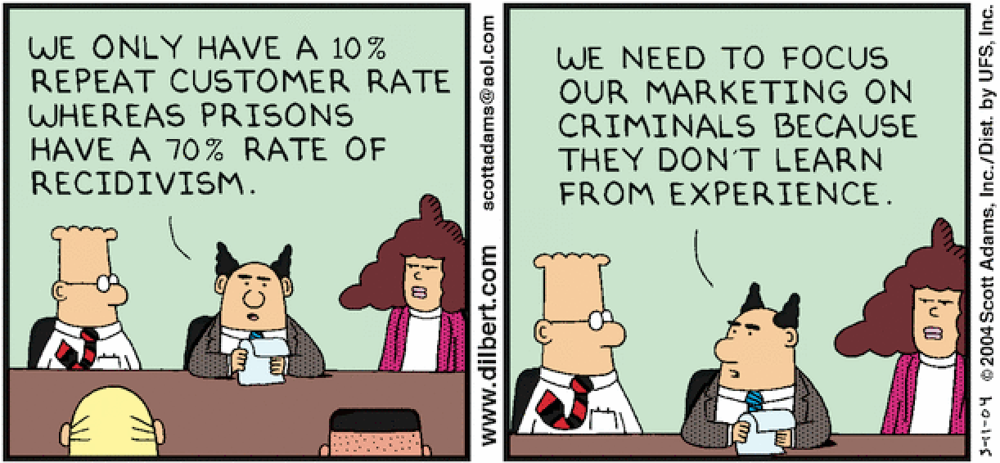
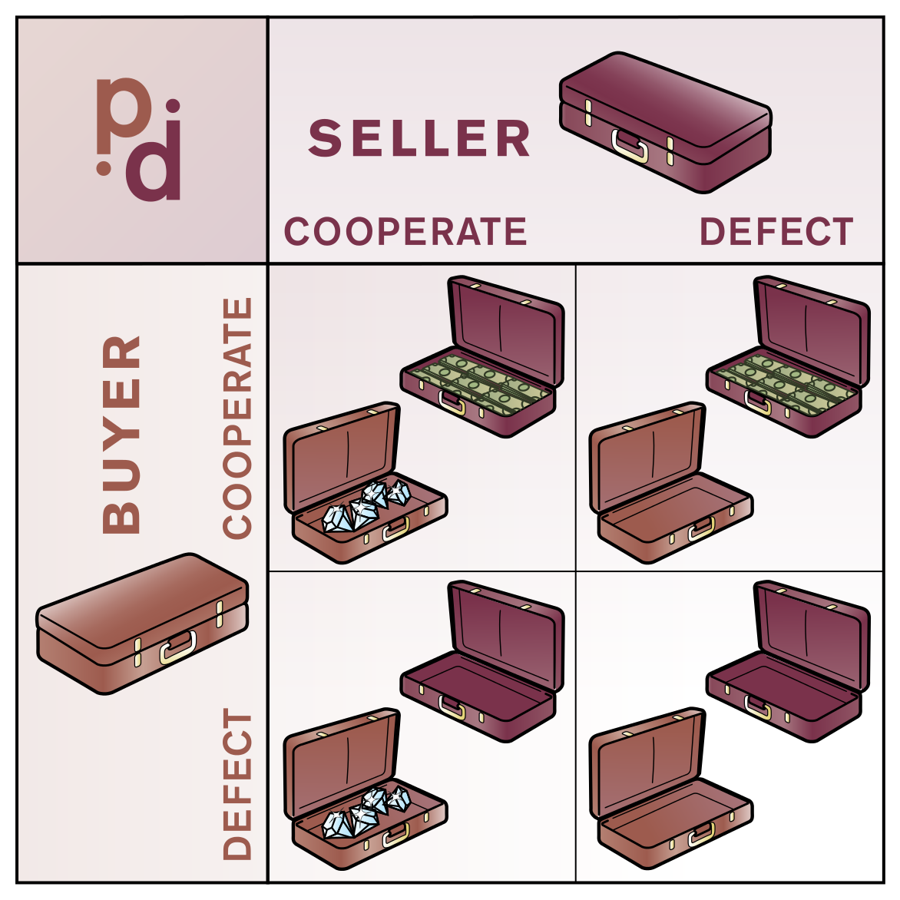
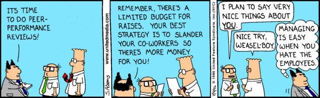

# Prisoner's behaviour, an economic dilemma

### Is that the only reasonable explanation?
### Q1. How much do you know about the Prisoner's Dilemma? (0-10)

???
*Title:* wanted to mix prisoner's dilemma with behavioural economics. That's what I ended up with ;D
*Open question:* e.g. punishment is not a deterrent (too soft?), people overvalue short-term vs future gains/payoffs, overconfidence in getting away, etc.
*Q1:* During the presentation I'll ask you a few quick questions to be answered with a number from 0 to 10.
*Q1 bis:* I think it will make the experience more fun and memorable if you do. You can complain at the end if you disagree :). Not going to A/B test this time.

---

# Outline

### 55% Part 1 Prisoner's dilemma
### 35% Part 2 Agents are people too
### 10% Part 3 Conclusions
The % is the approximate relative duration.

???
- I will introduce a semi-formal description of the problem along with the necessary game theory concepts to understand it
- I will present the limitations I see on direct aplications of PD in real live
- I will try to present what can we learn from PD in real for real live

---

# 1.1 Generic game tournament
### For each game: Win > Tie > Loose
### Many players tested 1 vs 1 (e.g. 14)
### Game played many rounds consecutively (e.g. 200)
### Final score per player is the sum of all scores

- **Player A**: Guaranteed to win each game**
- **Player B**: Guaranteed to tie or loose each game
- **Q2:** How condifent are you A will win* the tournament?
- **Q3:** How condifent are you B will win* the tournament?

???
- I promised talking about PD, but let's first look at a more generic example. This will hold true for PD and be useful in the future. Trust me ;D

I'll try to be neutral when asking the question. Just the prhasing already will influence the results, which words to choose? will win? will not win? will loose? confidence, sure, etc... good thing this is not a serious scientific study :D

*If players were to tie in final score, we consider both winners
**Played against an equivalent strategy will tie ^_^U

- Vote goes like this 5 means you are either in favour or against. 0 you think P will loose. 10 P will win. If confidence is too abstract think 6 a small amount of money, 7 modest amount, 8 a considerable amount, 9 a big amount, 10 a huge amount

- If people ask for clarifications: The number of rounds is finite and known in advance to each player (shouldn't matter yet).

---

# 1.2 Generalised PD

### Q4/Q5. You are the Buyer/Seller. What do you do?

???
Hofstadter suggests this transformation is easier to understand

---

# 1.3 PD Payoff matrix

- You can't comunicate
- You don't know each other
- You won't ever see each other again

### Q6. What do you do?

???

---

# 1.4 PD Payoff properties

### Nash equilibrium: Defect/Defect
### Pareto efficient: all other but Defect/Defect
### Superrational: Cooperate/Cooperate

???
- NE (dominant strategy). No single player can improve outcome by changing strategy. Other players already chose theirs and keep theirs.
- PO impossible to reallocate so as to make any one individual or preference criterion better off without making at least one individual or preference criterion worse off
- On a symmetric problem it's assumed all superrational players will reach the same conclusion. (Not part of standard Game Theory)
- More info on **superrational** Platonia dilemma by hofstadter Billonaire, 20 telegrams, no communication, etc. https://en.wikipedia.org/wiki/Platonia_dilemma

---

# 1.5 PD Repeated game (finite, N iterations)

### Same theoretical reasoning as single case.
### Backwards induction g1, g2, g3... gN-1, gN
### 1. Determine move for gN.
### 2. Determine move for gN-1.
### 3. We repeat this reasoning until we reach the g1

- **Player A**: Guaranteed to win each game**
- **Player B**: Guaranteed to tie or loose each game
- **Q7:** How condifent are you A will win* the tournament?
- **Q8:** How condifent are you B will win* the tournament?

???
1. We can ignore prev iterations (explain why)
2. We can ignore prev iterations (seee above). Also the last (we already determined that above)
3. We repeat this reasoning again until we reach g1

*If players were to tie in final score, we consider both winners
**Played against an equivalent strategy will tie ^_^U

- Vote goes like this 5 means you are either in favour or against. 0 you think P will loose. 10 P will win. If confidence is too abstract think 6 a small amount of money, 7 modest amount, 8 a considerable amount, 9 a big amount, 10 a huge amount

- This case is now for this specific game. Unlike previously.

---

# 1.6 Axelrod tournament I (1984)
(200 iterations, 14 algorithms)
### Always cooperate
### Tit for Tat
### JOSS (TfT with 10% chance of defect)
### Grudger (always defect once defected against)
### Always defect

???
Tit for Tat was the winner. But it is guaranteed to never win, or even loose (close to a tie though)
JOSS on the paper may look better that TFT. But it gets into defect spirals against it

---

# 1.7 Axelrod II, 2004 and beyond
(unkown iterations, many more algorithms)
### Tit for 2 Tat (II)
### Jennings/Ramchurn team (2004)
### Adding noise
### Infinite iterations

???
- Tit for 2 Tat would have won 1st championship. It avoids defect spirals unlike TfT. Now entries were more aggressive. It didn't win :-(
- University of Southampton Team. 20th anniversary edition of Axelrod (2004). 60/223 entries, 5/10-step handshake. Violates prev. comunication? 20 would have been enough.
- TfT will enter into a death spiral fast.
- Just mention that having infinite iterations and/or unkown upper limit may change rational strategy from always defect to other (e.g. Grim Trigger)

---

???
- Tit for 2 Tat would have won 1st championship. It avoids defect spirals unlike TfT. Now entries were more aggressive. It didn't win :-(
- University of Southampton Team. 20th anniversary edition of Axelrod (2004). 60/223 entries, 5/10-step handshake. Violates prev. comunication? 20 would have been enough.
- TfT will enter into a death spiral fast.
- Just mention that having infinite iterations and/or unkown upper limit may change rational strategy from always defect to other (e.g. Grim Trigger)

---

# 2.1 Nobody expects the Spanish Inquisition!
### 1st of October 2017
### >2M people in Catalonia voted in a referendum
### Political prisonners still in jail (>1 year without a trial)
### Facing charges of Rebellion (15-25 years)
### Many are elected MPs, altering parliament balance
### 712 mayors are being investigated (voting in public buildings)

???
- Imagine the most heinous crime. Yes, voting in a referendum! -Place voting urn on the table- . All of a sudden everybody is gone. The police detains you and another guy. Who brought the urn? That does look like a PD! A bit of a stretch, I know but, enough to see live is complex. Would you betray a fellow voter? But what if he/she is just a plainclothes police trying to trick you? What if you were voting with a friend? Or a close relative? Just this could very well change the strategy you choose.
- I could go on and talk about for the whole presentation on the situation in Spain, but let's move on.

---

# 2.2 Classic PD examples
### Climate change
### Marketing campaign

???
- Invest in renewable energy sources
- Start an ad campaign. Actually Tobacco companies in US benefited in 1970 from Public Health Cigarette Smoking Act, which banned cigarette ads from airing on television and radio and forces cooperation. At least in short term.

---

# 2.3 PD on real people
### 1993 paper by Robert Frank, Thomas Gilovich & Dennis Regan
### 1st year and last year Economics students
### Undergraduates from other faculties
### Which were the similarities and differences among groups?

???
- The paper was titled "Does Studying Economics Inhibit Cooperation?"
- All students overwhelmingly choose to cooperate... except for last year Economics. <- this are probably the guys recommending taxes and other policies to be implemented in our governments.
- "an eye toward both the social good and the well-being of their own students, economists may wish to stress a broader view of human motivation in their teaching."

---

# 2.4 Broken assumptions
### Reputation
### Consequences
### Payoffs (complete information)
### Uncertainty
### Collusion
### External influences
### Any more suggestions?

???
**Reputation** You don't know each other. But even it you don't you may infor something, their reputation, or even their name if you have prejudices. Is P2 rational? etc. If you don't know, you probably imagine you do or can infer (e.g. x% of population know game theory). Is the same if is a guy you don't know, a coworker, a friend, or a close relative?
**Consequences** You won't ever see each other again. You may get bad reputation, P2 may get revenge outside the system to you, etc.
**Collusion** You can't comunicate. Even if isolated, you may plan actions in event of getting caught
**Payoffs** If known paroffs certainly not neatly presented in a 2x2 matrix. Best case scenario just estimates/guesses
**Uncertainty** No guarantee a specific action will trigger a specific payoff
**External influences** It is likely parties will try to influence you to cooperate. You are not making the decision isolated on your own. Also time presure, if you defect first, etc.

---

# 2.5 Cost functions
### Loss is not linear
### Loss aversion
### Multiple losses != one big loss
### Survivability
### Cost symmetry
### Innocent prisoner's dilemma

???
- 1y vs 0y is not the same as 3y vs 2y
- gaining 200 and losing 100 feels much worse than just gaining 100
- losing 100 at once is less painful than losing 1 every day for 100 days (not accounting for inflation, cost of opportunity, etc.).
- e.g. if life expectancy is 2y, everything going beyond 2y = infinite negative payoff
- A 1y punishment for player A may feel like 2y for player B. E.g. player B is a minority and will be treated worse by jail inmates, etc.
- Somebody jailed for murder. Their condition to get parole is to admit the crime (even if negatively correlated with recidivism). What should they do? This happens in UK and USA.

---

# 3.1 Conclusions (from Axelrod)
### Be nice/optimistic
### Be provocable
### Don't be envious
### Don't be too clever/tricky

???
**Be nice:** cooperate, never be the first to defect.
**Be provocable:** return defection for defection, cooperation for cooperation.
**Don't be envious:** focus on maximizing your own 'score', as opposed to ensuring your score is higher than your 'partner's'.
**Don't be too clever:** or, don't try to be tricky. Clarity is essential for others to cooperate with you.

---

# 3.2 Further reading:

### PD: http://gametheory101.com/courses/game-theory-101/
### PD: https://github.com/Axelrod-Python/Axelrod
### BE: Thinking, Fast and Slow - 2011 Daniel Kahneman

*Q9* Please rate this talk. I won't judge :)
???
An online course with youtube video explanations. I based most of my theory from here.
An incredible tool built in python to simulate/visualise PD tournaments. It has >200 strategies and allows Moran processes and population evolution.
I got my bias and BE ideas from many places, but if I had to recomend only one it would be this one. It's >500 pag, but one is left wanting more.

---

# 3.3 Bonus?
# github.com/isaacbernat/presentations
### Infinitely Repeated PD
### Grim trigger (IRPD)
### TfT isn't subgame perfect (IRPD)

### Also interesting
- Folk Theorem
- Stochastic PD
- PD with continuous payoffs
- History/context of PD

???
- On that Github page I posted this presentation. I'll post a link to a google docs with a small additional survey. I'll also post results of in-presentation questionnaire.
- Discount factor on future values (delta). Geometric series
- 2*Reward > Temptation + Sucker
- E.g. 95% Cooperate and 5% Defect won't make my threats credible
