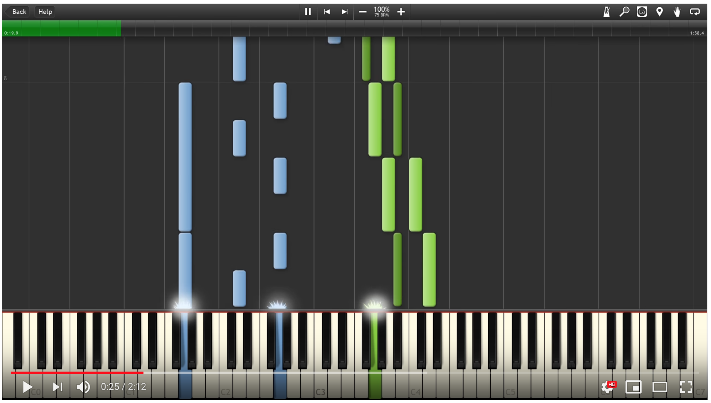
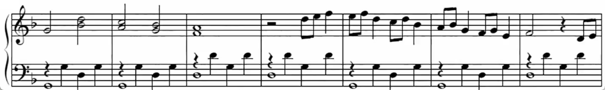
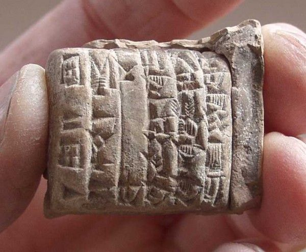
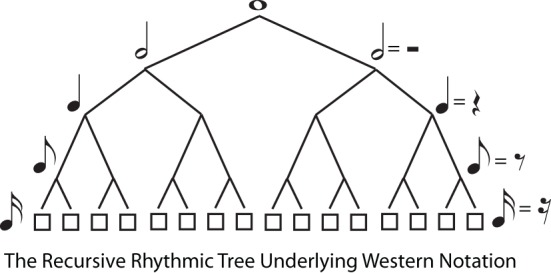
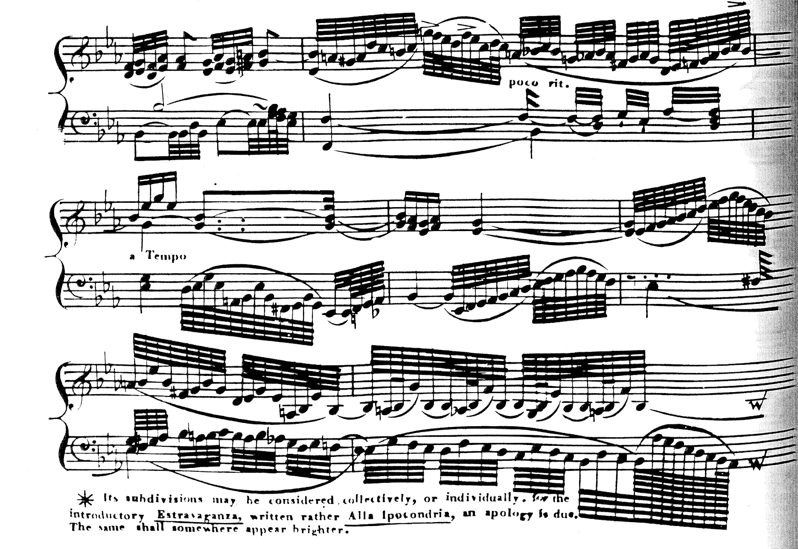
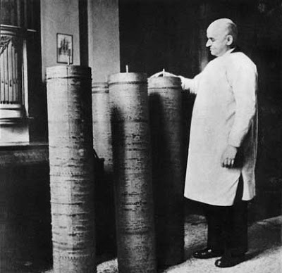
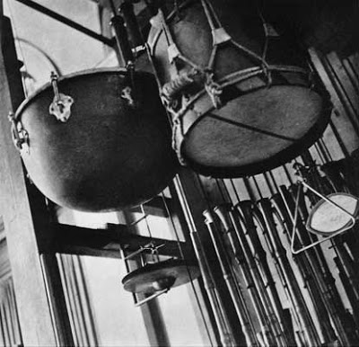
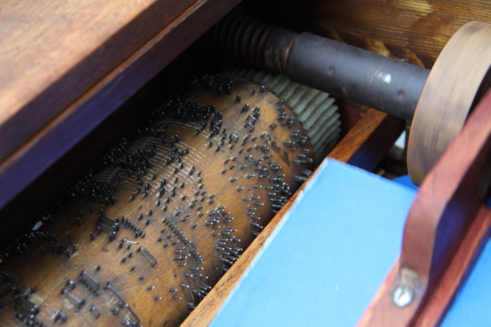
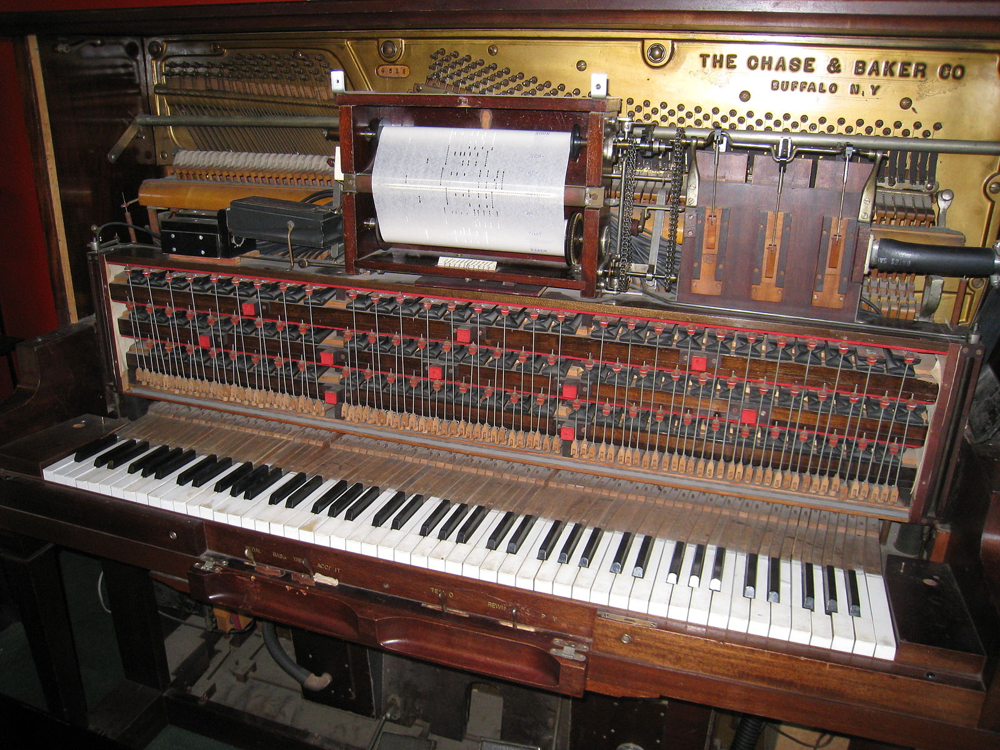

# Patterns beyond time and sound

### Rhythm:
- **recurring** alternation of contrasting elements, such as stressed and unstressed **notes** in music.
- i.e. a **sound** (or set of) which is **repeated** in time.

???
- **Disclaimer:** Today I will not go into the detail of **physics, perception of sound nor music theory**. Sorry.
- Other than that, feel free to interrupt and ask questions (but we can always ask at the end as usual).
- Excerpt from "The American Heritage® Roget's Thesaurus" courtesy of https://www.thefreedictionary.com/rhythm
- Point out the 2 different representations of the same rhythm (left hand) from Lady carey's Dompe. A piece 500 years old.

---

# Outline

### 50% Part 1 Rhythm notation.
### 35% Part 2 Real-time rhythm.
### 15% Part 3 Rhythm visualisation.

The % is the approximate relative duration.

???
- This is how the presentation is structured.
- Within each section I will advance **chronologically**.

---

# 1.1 Premodern sheet music
### Why record music?
### 1400 BC - Cuneiform tablets.
### 1473 - Printed sheet music.

???
- Why record text? **Memorisation** and oral tradition have their **limits**.
    - **Message degradation** (ever played Chinese Whispers or the *Telephone Game* (https://en.wikipedia.org/wiki/Chinese_whispers ?)
    - **Reach wider audiences**
    - **Keep for posterity**
    - **(con)** hard to note down all details/nuissances of a performance
- Tablets are **not sheet** nor western notation (which is our focus), but a good **precedent** (image from https://music.stackexchange.com/questions/29121/what-did-ancient-cuneiform-notation-look-like-and-how-did-it-work ).
- Printing enables overcoming previous limitations. A much wider audience to afford music, even **without actually having heard it** before. It's not anymore a mostly a **master/disciple** transmission of knowledge.

# Problem: rhythm involves time, but scripture is static. How do we solve that? With abstractions

---

# 1.2 Note duration
### Notes measured in relation to an ideal.
### Silence is music too!
### Comparable to each other.
### Rhythm can be represented!

???
- What's a note? A *pitched sound in time*. A unit of sound in a specific frequency (or range of). Since we are interested in rhythms here, let's the part relatd to pitch for now.
- We have notes and rests (contrasting elements) of different relative durations. That's all we need for rhythm right?

# Ok, how can we express note duration on paper?

---

# 1.3 Note representation
- **Semibreve** (whole note).
- **Crotchet** (quarter note).
- **Hemidemisemiquaver** (64th note).

???
- Writing down music has been a topic worked on for many centuries at this point (modern era). A good system to express *relative* length was devised. One could divide each note duration in half and this way achieve a high degree of precision. Also symbols were designed in a way that it was easy to know their relative duration to adjacent similar notes and new ones could be created as needed.
- There exists **auxiliary notation** to this, which simplifies representation of complex rhythms.
- If there is a **semibreve** is because there is also a breve and other **notation "higher up"**. Is not used that often, as British names beyond 64th are not so common either.
- **Balanced Binary Tree** image taken from https://www.researchgate.net/publication/258337267

# Example clapping. They have the same relative duration but sound different!

---

# 1.4 Pace and speed
### Barlines
  - **Group** musical segments.
  - ~1400 **arbitrary** duration.
  - ~1650 onwards **same** duration.

### Tempo
  - **Speed** at which a piece is to be played.
  - *Examples* (Italian): Lento, Presto, Andante.

???
- It's hard to describe **precise timing** instructions on a paper. Especially when only available devices were **sundials, hourglasses and water clocks.
- Lento -> slow; Presto -> fast; Andante -> walking pace... but people don't walk at the same pace!
- "Clementi is a charlatan, like all Italians. He marks a piece presto but plays only allegro." W.A. Mozart (regarding a competition in 1781 at the Viennese court, which was declared "tie". Mozart latter used the opening motif of a Clementi's sonata for his opening of The Magic Flute. After that Clementi added a note on all publications of the sonata that his was written 10 years earlier).

# That's quite subjective...

---

# 1.5 How fast is a 2048th?
### Vivaldi, Mozart et. al. used 256th
### Human hearing at 20hz or faster.

???
- Not so uncommon to have quite "extreme" notations. The same with many f or p, etc. but not relevant for rhythms (having 8?).
- This is **excluding** pieces intended as **jokes**, some known to go up to **65535th** as mentioned http://homes.sice.indiana.edu/donbyrd/CMNExtremes.htm
- The piece in the image (taken from wikipedia) is from early 19th century piece marked (Grave) (slowed than Lento or Adagio). Anthony Phillip **Heinrich's Toccata** Grande Cromatica from The Sylviad, Set 2, m. 16 **(c. 1825)**.
- At 20hz (50ms per note) and beyond human hearing stops discerning individual sounds and blends them into a single pitch. That's extremely fast, but not
unattainable. E.g. Marc-André **Hamelin** has some passages at **36ms** per note on a live recording of Alkan's Etude No. 7 Op. 39 (1857) as quoted in https://web.archive.org/save/http://homes.sice.indiana.edu/donbyrd/CMNExtremes.htm . Probably refering to this performance? https://www.youtube.com/watch?v=l8dP0LW0Ps8

# Ok, let's get objective!

---

# 2.1 Towards measurable intervals
- 1581 Galileo Galilei studies pendulums.
- 1696 E. Loulié builds first metronome.
- 1814 D.N. Winkel invents a double wighted pendulum.
- 1816 "Mälzel's metronome" is built.
- 1817 Beethoven adds MM in all his (8) symphonies.

???
- Galileo notices **isochronism** (pendulum oscillate at **same rate independent amplitude** for small swings). He uses his **heartbeat** to measure time (better than sundiarls or hourglasses).
- A long pendulum **without any sound**, but rather to be observed as a **conductor's baton**, the player should watch it's movement. This was a strong limitation, as musicians tended to rely on sound. On that era it was **common practise to beat the time** by banging a long staff on the floor. An example was Jean Baptiste **Lully**, who struck his toe in a **1687** concert. The injury became gangrenous, but he refused to have his foot amputated so he could still dance. Eventually gangrene extended and killed him. It wasn't until **19th century that conducting batons** started to gained popularity.
- It made a sound, it helped have **higher accuracy and be small** even at slow tempos.
- It was copied from Winkel. In fact he was famous for other treacheries such as buying (later **reselling it at 3x** the price he paid), modifying and touring with **The Turk in USA**, while **not paying debts** with the "chess operator" for more than one year, etc.
- Such an stablished figure **helped** make the use of metronome **acceptable and common**. Mälzel knew Beethoven as he **invented hearing aids** for him earlier on. That was probably paramount to the early and widespread adoption.
- **Electric, electronic, digital, etc.** New and future improvements in metronomes gave higher accuracy, precision and flexibility. But a **good enough standard** baseline was already set. Some more modern composer would measure pieces as a whole in seconds (e.g. Béla Bártok) though.
- Image taken from England's Patent.

# But that's not music per se, just a proxy for rhythm!

---

# 2.2 Mechanisation of music
- 1598 N. Vallin builds a clock with tuned bells.
- 1805 J. Mälzel builds the Panharmonikon
    - Features copied by others, including D.N. Winkel in 1821
- 1876 Piano players in Centennial Exposition in Philadelphia
- 1908 A industry-wide standard of 88 notes is agreed.
- 1982 MIDI is standarised.

???
- Flemish clockmaker Nicholas Vallin produces a wall mounted clock which has a **pinned barrel** playing on multiple tuned bells mounted in the superstructure. The barrel **can be programmed**, as the pins can be separately placed in the holes provided on the surface of the barrel.
- **Beethoven in 1813** wrote a piece to celebrate **Wellington's Victory** for this instrument, trying to seek financial stability for his future. Later **Mälzel** tried to claim the **composition as his own** and some disputes arised.
- Among all the machines, the elements that would conform a modern player piano were present. **Paper-based piano rolls** that described the music. Air would go through the wholes and would be amplified so a **pneumatic mechanism** would hit the keys. It was operated with **pedal bellows**.
- Standarisation is crucial for the industry to thrive. It creates economies of scale and such, allowing for wider repertoire, etc.
- MIDI (Musical Instrument Digital Interface). **Communication protocol** among different musical instruments. It uses events. In 2019 a new standard is being produced 2.0. With **32-bit per-note pressure** (instead of 128 values of 7-bit pressure on older standard, etc.)
- Images taken from https://unheardbeethoven.org
- Optional mention of Ligeti's 1962 "Poème symphonique" for 100 metronomes (and how the Dutch TV broadcast was cancelled, etc. https://en.wikipedia.org/wiki/Poème_symphonique).

# Interesting, can we go into detail?

---

# 2.3 Organ barrels

???
- The **length** of a piece was **limited by the size** of the instrument (and barrel)
- They could usually be shifted and **contain several tunes** in one barrel. Not all pins are played at once!
- Images from Wikipedia

---

# 2.4 Piano rolls

???
- After playing a roll it **must be rewinded** (like VHS!), but some players had both mechanisms at once, to play and rewind at the same time.
- An alternative known as "Book music" used cardboard in "continuous form paper", like dot matrix printers. Initially they were just punched cards tapped together.
- Several different ways to record and play a roll. Won't go in depth in this presentation.
- Images from Wikimedia Commons

# This is limited to a few instruments (which for MIDI is relatively big).

---

# 2.5 Audio recordings
- Phonautograms
- Wax cylinders
- Discs
- Magnetic
- Optical
- Digital

???
- A **standard reading rate** for each medium is soon stablished (e.g. 78 RPM). There was no doubt anymore on how fast or slow a piece was intended to be.
- I could discuss on the formats but this is becoming less and **less about rhythm, so I'll just skim** through it.
- Not very flexible. They play the **music "as is" and not many changes** can be easily introduced. Also **limited by real player capabilities**, finding proper ensembles, etc. **Midi in a way supersedes** this.
- Image from Wikipedia

# This is quite rigid. One can't change the tempo without changing the pitch...

---

# 3.1 Can metronomes be improved?
### They are simple. Too simple? Not enough?
### Tempo and time signature.
### [Let's try out!](https://www.google.com/search?q=metronome)

???
- Even if they are simple it's already **one extra abstraction layer** in addition to the music being played.
- Tempo is how fast. Time signature is how to emphasize the beats. **E.g. 3/4 vs 4/4**
- Google offers a super simple metronome to play with.

# Ok, tempos can be adjusted. Let's work on that basis

---

# 3.2 Metronome limitations
### Complex rhythms.
### Multiple instruments/timbres/sounds.
### Improvisation/composition.
### [Let's try out!](https://www.mikeslessons.com/groove/)

???
- At most simple time signatures which each sound evenly spaced is possible with a metronome.
- Different instruments produce different sounds, which are perceived differently. A metronome at most emphasises the beat. All other sounds being equal.
- Having a base line can help improvisation. Not only jazz or more modern genres, but older music too, as we saw at the beginning.
- When practising an ensemble piece one may want a more realistic accompaniment
- A more complex or realistic **base line** could be useful

# That's nice, what more can there be?

---

# 3.3 Visual patterns
### [TimeSig=4/4&Div=16&Tempo=100&Measures=1&](https://www.mikeslessons.com/groove/?TimeSig=4/4&Div=16&Tempo=100&Measures=1&H=|xxx-xxx-xxx-xxx-|&S=|----O-------O---|&K=|o-------o-------|&T1=|---o---oo-------|&T4=|---o---oo-------|)
### H=|xxx-xxx-xxx-xxx-|&S=|----O-------O---|&
### K=|o-------o-------|&T1=|---o---oo-------|&T4=|---o---oo-------|
### [Rhythm Radar](http://isaacbernat.github.io/rhythm-radar/)
### [Fully compatible](http://isaacbernat.github.io/rhythm-radar/?TimeSig=4/4&Div=16&Tempo=100&Measures=1&H=|xxx-xxx-xxx-xxx-|&S=|----O-------O---|&K=|o-------o-------|&T1=|---o---oo-------|&T4=|---o---oo-------|) :)

???
- It's quite **neat**, very easy to encode a **rhythm in the URL**. It also allows you to **download as a MIDI** file and the interface is nice.
- This guy shared his code in **github**
- My brother has been playing the drums for almost 20 years now. But still he says sheet music does not help him visualise rhythms that much. Even real-time approaches like we saw on the first link. I thought that **rhythms** are often **cyclical patterns. Circles** are one of the best ways to represent cycles which keep repeating. So... 3 years ago I spend a couple of days on this pet project, I hacked together a couple of sunburst demos which used d3.js and got this!

# I hope you liked it, because it ends here ;D

---

# 3.4 The end! -> github.com/isaacbernat
### Today starts [Stockholm Early Music Festival](https://www.semf.se/)

???
- To conclude, you may want to hear the rhythms we displayed on the beginning of the presentation.
- Also the presentation and all it's references and cite material may be found here https://github.com/isaacbernat/presentations/tree/master/rhythm
