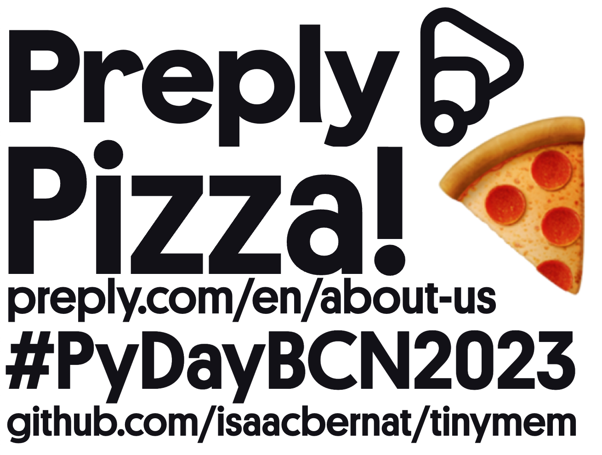
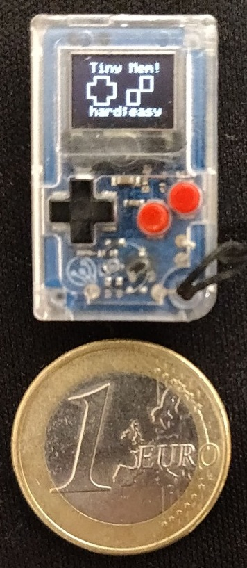
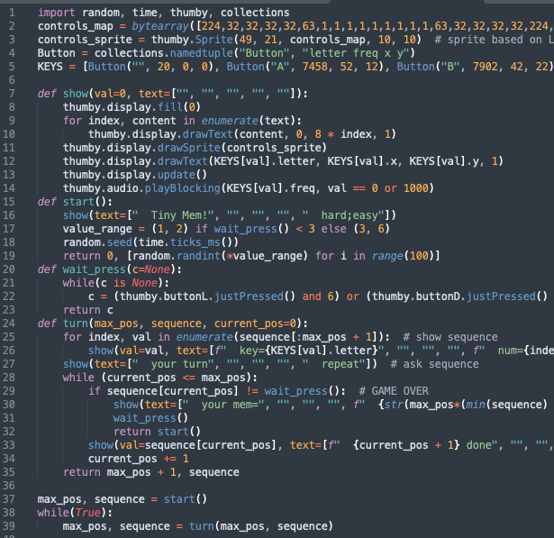
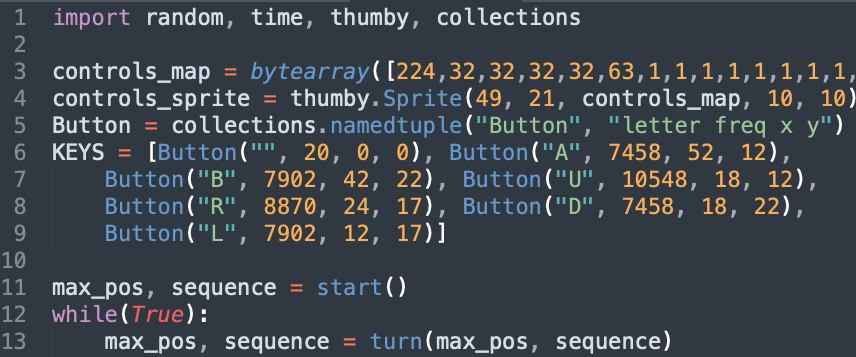
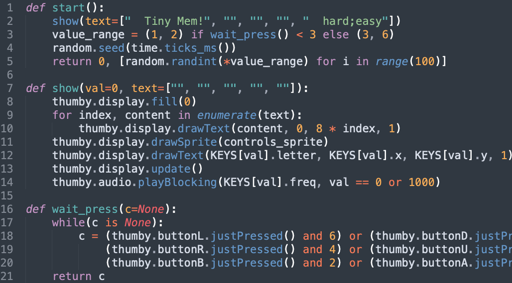
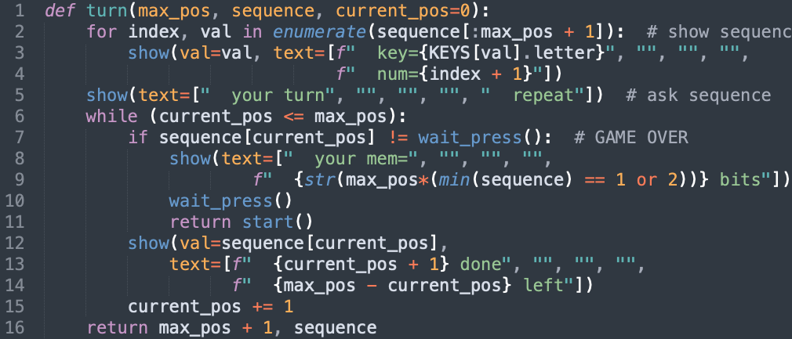

???

- **Welcome** to the last talk of PyDayBCN2023
	- I work at **Preply**, one of the **event sponsors**
	- An **EdTech startup**. It's not about food delivery, but I guessed you'd be tired after a whole day of workshops so I thought a big pizza slice would get your attention ^_^
	- It was founded in **2012 in Kyiv**
	- Opened offices in **Barcelona in 2019**
	- Since then, we opened **offices in NYC** got **$165M** in funding and more cool things to list
	- We are **hiring**, well-funded and a cool place to work.
	- Check the **link for more info, our booth** or talk to me later.
- In this **repo** you'll find all the info related to today's talk

---

# Tinymem: a game under 40 lines/30mm

???

- On the **left side** we can see Thumby
- A small video console system based on **Raspberry Pi Pico**
- As you may see, has **6 buttons** (4 are D pad) and a screen (with different brightness levels)
- And as you **can't** see it has **audio** and other capabilities we'll showcase :D

- On its largest dimension is less than **30mm long.** Other are even smaller
- Euro **coin for size** comparison.
- Turn on/share **physical devices** with the audience
- It's running the tinymem game
- The code is **not PEP8 compliant** but fits well under 40 lines

---

<video width="100%" controls>
  <source src="./tinymem_pybcn.mp4" type="video/mp4">
</video>

???
- This is a short video of **gameplay**. Will help understand how the game works.
- It's basically a clone of the **Simon** game from the 1970s
- The first screen is **a menu**. Clicking a button or the direction pad selects **difficulty**
- Once it's chosen, the game starts a **sequence** that must be **repeated in the same order**
- The sequence gets **longer every time** with one additional button press
- It uses **sounds to help memorise** the sequence, one unique per button. It's hard to appreciate in the recording though.
- When the sequence is wrong, it's **game over**. You are **told your memory** and you can restart again

---

# Code pt1: imports, constants and game loop

???
- Part 1: 1: **imports**, libraries we'll use that makes our life easier, don't reinvent the wheel
- Part 2: 3-9: **constants**
	- 3 the binary representation of the sprite. Which pixels should be turned on or not (there's not greyscale, sorry)
	- 4 binding that sprite to a screen position
	- 5 An aid to make button bindings more human readable
	- 6 The keys we want to map, used for the game
		- `letter`: symbol we'll display on-screen
		- `freq`: is the sound in Herz it will make when the button is activated
		- `x, y`: the coordinates on the screen that button occupies
- Part 3: 11-13: **'game loop'**
	- 11 **init screen**
		- `max_pos`: is used to know how many characters should we feed the user
		- `sequence`: is the **data to be fed to the user**, one value at a time
	- 12 **game loop**. Once here, there's no scape
	- 13 **turn**. When a turn is completed, a new one is called

---

# Code pt2: start, show and wait press

???
- Part 1: 1-5: **start**
	- 1 **show text**. Well get to that below
	- 2 **select difficulty**, depending on the button the user clicks,
	The sequence will use a set of characters or another. **A/B (binary) vs arrows (quaternary)**
	- 3 **random**, initialise using time, so the sequence is different every occasion
	- 4 **return initial position** and the sequence of values for this game
- Part 2: 7-14: **show**
	- 8 **blank** screen (set all pixels to 0 value)
	- 9 **for each** line of text
	- 10 **drawText**
		- the ASCII text
		- x, y coordinates (updated each line, to not overwrite)
		- black/white colour
	- 11 **drawSprite**, that's our buttons representation wireframe. It doesn't change
	- 12 **activated button**, display the letter corresonding to it in the correct position
	- 13 **update** the screen. All previous information was written to a buffer. We show all at once.
	- 14 **sound** to be played according to the letter and **blocking the input** for 1000 or milliseconds

- Part 3: 16-21: **wait_press**
	- 17 **loop** until there's a **new input**
	- 18-20 **read buttons** for each button, check if it has been pressed
	- 21 **return** which button has been pressed

---

# Code pt3: turn

???
- Part 1: 2-4: **show sequence**
	- 2 **loop** throw all the sequence up to max_pos + 1
	- 3-4 **for 1 second each** show letter, position, play sound...
- Part 2: 5-6: **now your go**
	- 5 **tell user** it's their turn now
	- 6 **are you done?** until the user has not reached the max position keep looping
- Part 3: 7-11: **you messed up!?**
	- 7 **read value** of the user input, check with the expected in the sequence
	- 8-9 **tell user** how much memory they had, accounting difficulty
	- 10: **ACK** wait for user to acknowledge game is over, and how well they did
	- 11: **restart** the game is ready to be retried again :D
- Part 4: 12-15: **doin' good so far!**
	- 12: Show **button** that had just been pressed
	- 13: Tell **how far** on the sequence the user is
	- 14: Tell how many **chars remain** this turn.
	- 15: **Increase** current position and **ask again (line 6)**
- Part 5: 16: **you did well!** let's increase 1 max position and repeat!
---

# GAME OVER

TODO

???

--- 

# BONUS: IDE

TODO

???
