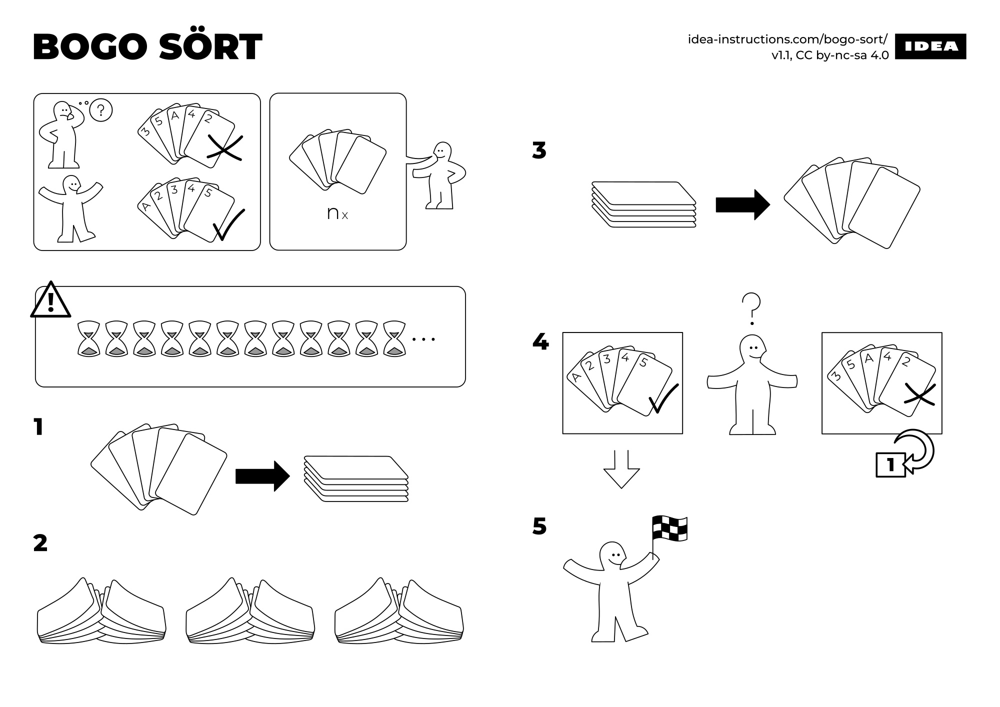
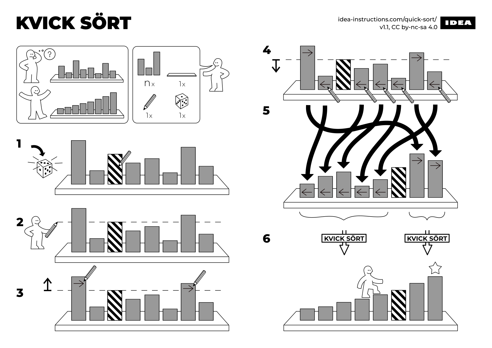
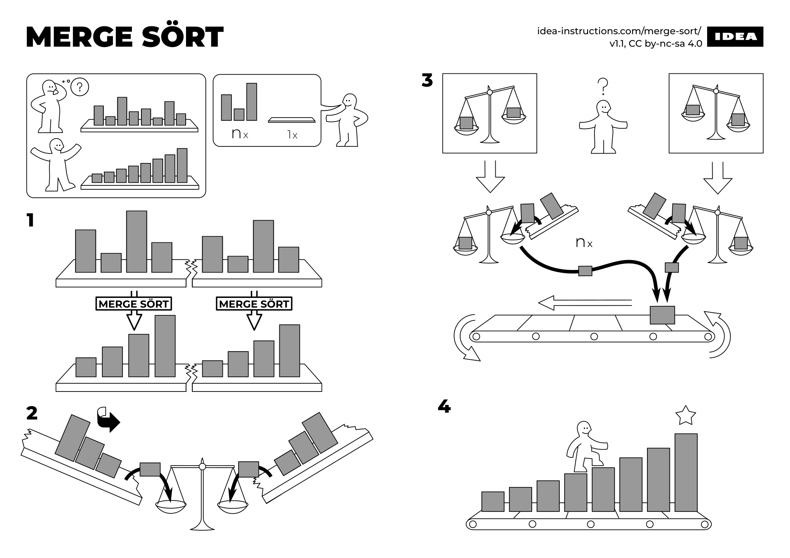

<div style="text-align:center; margin-left:-2rem"></div>

---


<div style="text-align:center; margin-left:-2rem"></div>

---


<div style="text-align:center; margin-left:-2rem"></div>

---

# Binary Swap:

```
if val[0] > val[1]:
    tmp = val[0]
    val[0] = val[1]
    val[1] = tmp
```

---

# Quadsort

This eliminates 1 wasteful comparison for in-order sequences while creating 1 additional comparison for random sequences. However, in the real world we are rarely comparing truly random data, so in any instance where data is more likely to be orderly than disorderly this shift in probability will give an advantage.

There should also be a slight overall performance increase due to the elimination of wasteful swapping.

This allows quadsort to sort in order and reverse-order sequences using n + log n comparisons instead of n * log n comparisons.

---

# Quad Swap costs. 
- initialisation plus...
- cost to swap sorted 0 1 2 3 -> 1 if
- cost to swap sorted 3 2 1 0 -> 2 if
- cost to swap unsorted any   -> 4 if

---

# Step 1
## initialise and sort tmp variables pair-wise
```
tmp0, tmp1, tmp2, tmp3 

if val[0] > val[1]:
    tmp0 = val[1]
    tmp1 = val[0]
else:
    tmp0 = val[0]
    tmp1 = val[1]

if val[2] > val[3]:
    tmp2 = val[3]
    tmp3 = val[2]
else:
    tmp2 = val[2]
    tmp3 = val[3]
```

---

# Step 1 is equivalent to this. 
## It may be implemented without branching.

```
tmp0, tmp1, tmp2, tmp3 

tmp0 = min(val[0], val[1])
tmp1 = max(val[0], val[1])
tmp2 = min(val[2], val[3])
tmp3 = max(val[2], val[3])
```

---

# Step 2
## Are they sorted? Then we are done!
```
if tmp1 <= tmp2:
    val[0] = tmp0
    val[1] = tmp1
    val[2] = tmp2
    val[3] = tmp3
```

---

# Step 3
## Are they reverse-sorted? Then we are done!
```
elif tmp0 > tmp3:
    val[0] = tmp2
    val[1] = tmp3
    val[2] = tmp0
    val[3] = tmp1
```


---

# Step 4 
## We were not so lucky. Let's sort it now!

```
else:
   if tmp0 <= tmp2:
       val[0] = tmp0
       val[1] = tmp2
   else:
       val[0] = tmp2
       val[1] = tmp0

   if tmp1 <= tmp3:
       val[2] = tmp1
       val[3] = tmp3
   else
       val[2] = tmp3
       val[3] = tmp1
```

---


## Other sorting algorithms

### Timsort
Used in Python, Android, Chrome, etc.

Similar to mergesort but: 
- instead of partitioning on a fixed sizes it does so trying to use subsets that are already sorted or almost sorted of different sizes. 
- Then it merges together those of similar sizes (it's more efficient than very big different sizes). 
- Since we want a stable algorithm it can only merge contiguous groups
- It uses less auxiliary memory

It's quite complex, in fact it was formally proven in 2015 that an official implementation was wrong and it would crash when sorting more than 2^26 elements

https://en.wikipedia.org/wiki/Timsort

---

### Heapsort
- not stable
- in place (no additional memory)
- n log n
- make heap (cost N)
- bubble up un element at a time and so the same with resulting subheap (cost log n per opertation)
https://en.wikipedia.org/wiki/Heapsort
- harder to parallelise than mergesort
- worse with caches than mergesort


### Grailsort
https://github.com/Mrrl/GrailSort

### Fun fact:
- Quicksort was implemented in 1959 finding a better algorithm than shellsort to sort data in tapes. He bet 6 pence with their boss that it could be improved.


---

### No silver bullet
- how data looks like matters (is it mostly sorted? repeated values? many different values? (e.g. bad for radixsort))
- hardware too (e.g. exploting cache, how many registers does the machine have (for fast tmp variables), locality, branching, comparisons, etc.)
- is the amount of data big?

### But remember...
- **Q:** "What, is the most efficient way to sort a million 32-bit integers?"
- **A:** "Well, I think the bubble sort would be the wrong way to go." 
- *Barack Obama.*


